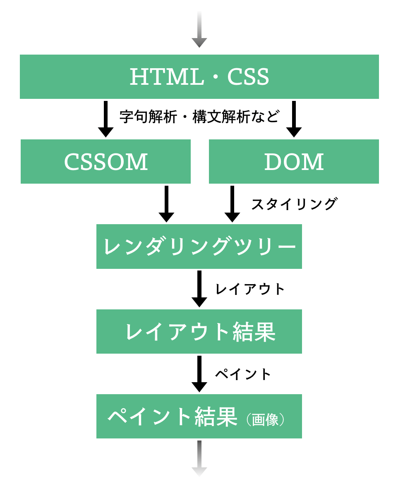
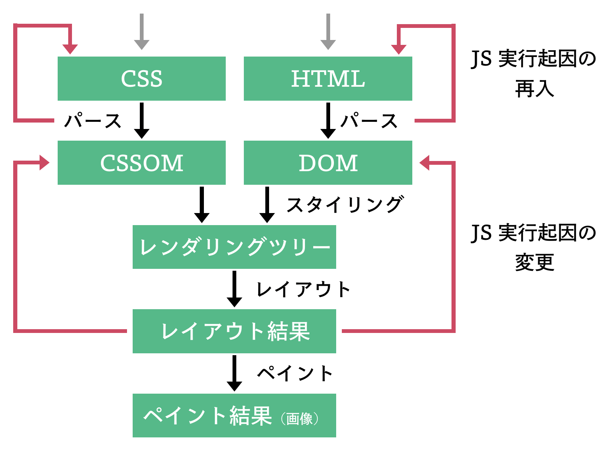

終わりの見えない旅は、その道中がどんなに楽しいものであっても、次第に旅人を不安にいざなうものです。
そこで本章は、Web ブラウザの実装に入る前に把握しておきたい基本的なコンセプトを、Web ブラウザの担っている機能の紹介を通して整理します。
その上で Part 1 や Part 2 それぞれでどのような Web ブラウザを作成するかを説明します。

## Web ブラウザの機能

今あなたは本オンラインブックを Web ブラウザで閲覧しているはずです。
そんなあなたのブラウザの中では、あなたの今見ている画面を描画するまでの間に、ほんとうに沢山の機能が利用されてきています。

また、現代の Web ページの多くは動的なスクリプトを伴っており、Web ページ上でのあなたの操作に応じて動的に画面を変化させるようなものになっています。
このような Web ページの動的性は、スクリプトを実行するためのエンジンを始めとした多くの機能により支えられているものです。

そもそも、本オンラインブックに遷移してくるまでの過程でも、あなたは Web ブラウザの何らかの機能を利用してきたはずです。
このページをブックマークに登録している方はブックマーク機能を使ったことでしょうし、一度このページを離脱した方は「戻る」「進む」ボタンを利用したことでしょう。
[https://browserbook.shift-js.info](https://browserbook.shift-js.info) という URL を覚えていたので、アドレスバーを利用して本オンラインブックに遷移してきたという方もいるでしょうし、他の Web ページからのハイパーリンクをマウスでクリックすることでここまで来た方もいるでしょう。
Web ページにアクセスする、という単純な行為一つのためにも多くの機能が存在しているのです。

ここまで述べてきたように、Web ブラウザには多くの機能が備え付けられています。
ここからは、それらの機能を、一旦以下のように大きく 3 つのグループに分類することにします[^better_classification]:

1. **Web ページを表示するための機能**
2. **Web ページの動的性のための機能**
3. **Web ブラウジングのための機能**

その上で、1 つめと 2 つめのグループをそれぞれもう少しだけ掘り下げ、それらの機能グループがどのような要素機能から実現されているかを整理することにします。

[^better_classification]:
    この辺に関しては、何らかの文献がよりよい分類を与えていたように記憶しているのですが、筆者がその文献がどこにあったかを忘れてしまいました。
    よりよい分類方法をご存知の方がいればぜひご教示ください。

### Web ページを表示するための機能

ある URL が指す Web ページを画面に表示する際、Web ブラウザは、URL で指定されたリソースを **Hyper-Text Transfer Protocol（HTTP）** 等のプロトコルを用いて取得します[^network_on_chromium]。
その上で、リソースの種別を判定し、種別ごとに適当な処理を行います。

いま、取得してきたリソースが HTML ファイルだった場合には特に、["Render-tree Construction, Layout, and Paint  |  Web Fundamentals"](https://developers.google.com/web/fundamentals/performance/critical-rendering-path/render-tree-construction) に書かれているような以下の過程を経て画面に同 HTML ファイルが描画されます:

1. HTML・CSS を処理して以下を構成する:
   - **Document Object Model（DOM）**[^note_on_dom]
   - **CSS Object Model（CSSOM）**
2. DOM と CSSOM から **レンダリングツリー（Rendering Tree）** を生成する。
3. レンダリングツリーを **レイアウト（Layout）** [^layout] する。
4. レイアウト結果を画面に **ペイント（Paint）** [^paint] する。

この過程の中でまずはじめに行われるのは Document Object Model（DOM）の生成と CSS Object Model（CSSOM）の用意です。
これはそれぞれ HTML 文字列と CSS 文字列に対して字句解析と構文解析を施すことにより構成されます。

用意された DOM や CSSOM は、その後にレンダリングツリーと呼ばれるブラウザ内部での中間表現に変換されます。
レンダリングツリー内の要素の画面内での位置はレイアウトという過程により決定され、レイアウトの結果は最終工程であるペイントの工程で画面に実際に描画されます。

この過程を図示すると次の図の通りです:



もっとも、この過程は、ブラウザ実装によって若干内部的な呼び方が異なったり、更にこまかく分解されていたりするものです。
各 Web ブラウザ実装における詳細については以下を参照してください:

- Chromium: ["The Rendering Critical Path"](https://www.chromium.org/developers/the-rendering-critical-path) や ["Life of a pixel"](https://docs.google.com/presentation/d/1boPxbgNrTU0ddsc144rcXayGA_WF53k96imRH8Mp34Y/edit#slide=id.ga884fe665f_64_6)
- Firefox: ["Design · servo/servo Wiki" の Task communication diagram](https://github.com/servo/servo/wiki/Design#task-communication-diagram)

[^note_on_dom]: DOM という言葉はブラウザ実装の中の中間表現を指すものとして扱われることもあれば、JavaScript に対して露出されている API のことを指すものとして扱われることもある点には注意が必要です。
[^network_on_chromium]: [Life of a URLRequest](https://chromium.googlesource.com/chromium/src/+/refs/heads/main/net/docs/life-of-a-url-request.md) で述べられているように、Chromium の場合は [services/network/](https://chromium.googlesource.com/chromium/src/+/HEAD/services/) で定義されている _Network Service_ という [サービス](https://chromium.googlesource.com/chromium/src/+/HEAD/docs/mojo_and_services.md) を通して [net/](https://chromium.googlesource.com/chromium/src/+/HEAD/net/) で定義されている *Network Stack*が呼び出されることでこの周辺の処理が達成されるようです。Firefox の場合は [network/](https://hg.mozilla.org/mozilla-central/file/tip/netwerk) 以下のスタック（Necko）とその周辺がネットワークに関連した処理の責務を負っているようです。
[^layout]: レイアウトは**リフロー**とも呼ばれます。
[^paint]: ペイントは**ラスタライズ**とも呼ばれます

### Web ページの動的性のための機能

多くの Web ページを動的なものたらしめている、Web ブラウザによる JavaScript の実行のために、多くのメジャーなブラウザ実装はそれ専用のエンジンを利用しています。
例えば Chromium は [V8](https://v8.dev)、Firefox は [SpiderMonkey](https://spidermonkey.dev/) という JavaScript の実行エンジンを利用しています。

もっとも、JavaScript が DOM を始めとした Web ページの情報と無関係に実行されるのでは意味がありません。
JavaScript から DOM にアクセスできるなどの形で、当該 JavaScript コードがロードされた Web ページの Web ブラウザ上での状態に JavaScript からアクセスできるからこそ Web ページには動的性がもたらされるのです。
また、`fetch()` などの関数により JavaScript からネットワーク通信を発生させたり、`alert()` などの関数により Web ブラウザの UI を操作したりできる、というのも現代の Web には欠かせない要素でしょう。

このような JavaScript エンジンと Web ブラウザの連携のために、Web ブラウザは、JavaScript エンジンに対していくつかのインターフェイスを提供しています。
DOM API や Fetch API がその例です。
また、このようなインターフェイスの定義は **Web IDL** と呼ばれる言語で記述されます。JavaScript と Web ブラウザ側実装を繋げるコードは **バインディング（Binding）** などと呼ばれ、その一部は、Web IDL をもとに生成されています。

> :muscle: **【演習: Web IDL に慣れ親しむ】**
> Chromium で利用されているレンダリングエンジン Blink のソースツリーの [third_party/blink/renderer/core](https://chromium.googlesource.com/chromium/src/+/refs/heads/main/third_party/blink/renderer/core/) や、Servo のソースツリーの [components/script/dom/webidls](https://github.com/servo/servo/tree/master/components/script/dom/webidls) を眺めて、さまざまなインターフェイスの `.idl` 定義を眺めてみましょう。Chromium のほうを眺める際には、["Web IDL interfaces - The Chromium Projects"](https://www.chromium.org/developers/web-idl-interfaces) が参考になるかと思います。

もっとも、現代の Web ページに含まれているような JavaScript の実行を許そうとすると、Web ページを画面に描画するための過程はより煩雑になることには注意しなくてはなりません。
これは DOM を構成する最中に実行される JavaScript が `document.write()` などにより新たな HTML のパース処理を引き起こしたり、DOM API を通して DOM を変更する可能性があるからです[^parsing_model]。
このような要素を考慮したときの Web ページが画面に描画されるまでの流れを以下の図に示します。



[^parsing_model]: この周辺について深く知りたい方は [HTML Standard の Overview of the parsing model の項](https://html.spec.whatwg.org/multipage/parsing.html#parsing) を確認してください。

### Web ブラウジングのための機能やその他の機能

> :construction: この項目は現在準備中です。

## これから作るもの

ここまで挙げてきたような機能の全てを持った Web ブラウザを一人で作るのは現実的ではありません。
しかし、(1) 現代 Web ブラウザのソースツリーに向かい合う地盤を作ること、(2) 現代 Web に対するよりシャープな目を獲得することの 2 点を目的として Web ブラウザを開発するのであれば、そのために再発明すべきブラウザの機能は限られています。

本オンラインブックでは、これから Part 1 から Part 2 にかけて、そのような再発明すべき機能を順に開発していくことにします。
その際には Rust 言語を用います[^rust]。

[^rust]: Chromium を始めとした多くの Web ブラウザ実装は C++ で記述されています。そんな中 Rust を採用した Servo チームは ["Experience Report: Developing the Servo Web Browser Engine using Rust"](https://arxiv.org/abs/1505.07383) において、この過程で経験したことを取りまとめています。興味がある方はぜひ目を通してみてください。

### Part 1 で作るもの

Part 1 では、以下のような HTML をターミナル内で表示できる Web ブラウザを作ることを目指します:

```html
<body>
  <p>hello</p>
  <div class="inline">
    <p>wor</p>
    <p>ld</p>
  </div>
  <div class="none">
    <p>this should not be shown</p>
  </div>
  <style>
    .none {
      display: none;
    }
    .inline { 
       display: inline;
    }
  </style>
</body>
```

そのために、まずは [「HTML を取り扱う」](/chapters/parsing-html) において、HTML をパースして DOM を構成する処理を実装します。
ここで実装するものは、リファレンス実装の `puppy::core::html` モジュール（[src/core/html.rs](https://github.com/lmt-swallow/puppy-browser/blob/b2d37ec2791bb3bfc44224a9d6c44b9a6ab73b0c/src/core/html.rs)） や `puppy::core::dom` モジュール（[src/core/dom.rs](https://github.com/lmt-swallow/puppy-browser/blob/b2d37ec2791bb3bfc44224a9d6c44b9a6ab73b0c/src/core/dom.rs)）に該当します。

その後は [「CSS を取り扱う」](/chapters/parsing-css) において、CSS から CSSOM を構成する処理も実装します。リファレンス実装の `puppy::core::css` モジュール（[src/core/css.rs](https://github.com/lmt-swallow/puppy-browser/blob/b2d37ec2791bb3bfc44224a9d6c44b9a6ab73b0c/src/core/css.rs)）がこの章で実装するものにあたります。

DOM と CSSOM を構成するための処理が実装できたら、[「レンダリングツリーを作る」](/chapters/building-rendering-tree)において、DOM の情報と CSSOM の情報をうまく組み合わせることでレンダリングツリーを構成する処理を実装します。
ここでの実装物は、リファレンス実装における `puppy::core::style` モジュール（[src/core/style.rs](https://github.com/lmt-swallow/puppy-browser/blob/b2d37ec2791bb3bfc44224a9d6c44b9a6ab73b0c/src/core/style.rs)）の実装に対応します。

ここまでが出来たら、[「レンダリングする」](/chapters/rendering) において、実際にレンダリングツリーをターミナル上に描画する処理を簡単に実装します。
この描画処理はリファレンス実装の `puppy::core::render` モジュール（[src/core/render.rs](https://github.com/lmt-swallow/puppy-browser/blob/b2d37ec2791bb3bfc44224a9d6c44b9a6ab73b0c/src/tui/render.rs)）が取り扱っているものです。
もっとも、この箇所は実装を簡単にするために、現代 Web ブラウザがもつレンダリングの仕組みは乖離が大きいような実装を採用することにします。
また、この章では、Web ブラウジングのためのユーザーインターフェイスもついでに作成することにします。

以上の流れを一通り体験し終えたころには、Web ブラウザが持つ基礎的な仕組みや、Web ページが画面に描画されるまでの流れに対しての理解が深まっているはずです。
ここで得られる知識は、既存の Web ブラウザの実装（これは当然 Part 1 で実装するものに比べて果てしなく複雑です）に向き合う上でも、Web ページの製作においても、あらゆるところで役に立つことでしょう。

### Part 2 で作るもの

Part 2 では、Part 1 で作成した Web ブラウザをさらに拡張して、以下のような HTML を処理することを目指します:

```html
<body>
  <p>hello</p>
  <div class="inline">
    <p>wor</p>
    <p>ld</p>
  </div>
  <div class="none">
    <p>this should not be shown</p>
  </div>
  <style>
    .none {
      display: none;
    }
    .inline { 
       display: inline;
    }
  </style>

   <div id="result">
      <p>not clicked yet</p>
   </div>
   <div>
      <input type="submit" onclick="document.getElementById(`result`).innerHTML = `\x3cp\x3eclicked!\x3c/p\x3e`;"
         value="click me"></input>
   </div>
   <div>
        <input type="submit" onclick="window.alert(`hello world!`);" value="show alert"></input>
   </div>
   <script>
      console.log('hello');
   </script>
</body>
```

この Web ページは、Part 1 で表示することを目標としたものに、更に以下を加えたものです:

- `onclick` イベントハンドラによる以下のような JavaScript コードの実行
  - DOM を操作するような JavaScript コード
  - アラートダイアログを表示する（≒ UI に変更を加える）ような JavaScript コード
- `<script>` タグによる JavaScript の実行

Part 2 では、まず [「JavaScript の扱いを考える」](/chapters/about-js) において、JavaScript 実行のために必要なことを検討するところから始めます。
その上で、[「V8 を組み込む」](/chapters/integrating-v8) において、Chromium も利用している JavaScript エンジンである [V8](https://v8.dev) と Part 1 で作成した Web ブラウザを接続することを試みます。
とりわけこの時点ではリファレンス実装の `puppy::javascript::runtime` モジュール（[src/javascript/runtime.rs](https://github.com/lmt-swallow/puppy-browser/blob/b2d37ec2791bb3bfc44224a9d6c44b9a6ab73b0c/src/javascript/runtime.rs)）のサブセットを実装します。

その後、[「イベントハンドラを捌く」](/chapters/handling-events) において、`onclick` イベントハンドラを処理するようなコードを追加します。
また、[「ミニ DOM API を作る」](/chapters/building-dom-api) や [「ミニ Fetch API を作る」](/chapters/building-fetch-api) を通して、作成した Web ブラウザの機能を JavaScript に露出する
なお、リファレンス実装においては、JavaScript バインディングの実装は `puppy::javascript::binding` モジュール（[src/javascript/binding.rs](https://github.com/lmt-swallow/puppy-browser/blob/b2d37ec2791bb3bfc44224a9d6c44b9a6ab73b0c/src/javascript/binding.rs)）や `puppy::javascript::api` モジュール（[src/javascript/api.rs](https://github.com/lmt-swallow/puppy-browser/blob/b2d37ec2791bb3bfc44224a9d6c44b9a6ab73b0c/src/javascript/api.rs)）に格納されています。

## まとめ

この章では Web ブラウザの持つ機能をいくつか挙げながら、Web ブラウザの実装の前に把握しておきたい基礎的なコンセプトを紹介した後、とくに本オンラインブックではどのような Web ブラウザをどのような流れで実装するのかをを整理しました。
