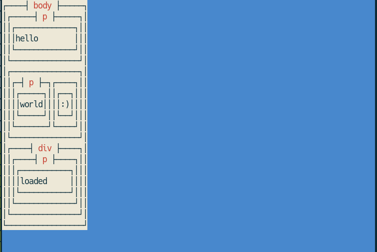

["JavaScript エンジンを組み込む"](/chapters/integrating-v8) では、JavaScript エンジンである V8 を利用するようなコードを、Part 1 で作成した Web ブラウザのコードベースに追加しました。
この章では Web ページ中の JavaScript が簡単な DOM 操作を行えるように、V8 エンジンと Web ブラウザ実装を接続します。

> **:memo: 注意** 本オンラインブックはセキュリティ・キャンプでの講義の事前資料であり、かつこの周辺は講義で詳細に扱う予定があまりありません。
> したがって本章は、一旦リファレンス実装（後述）を読む際の資料として使える程度の大雑把さで書いてあります。
> 筆者の余裕ができた頃に大幅に書き直す予定です。

## 本章での実装方針

JavaScript から DOM を操作する際には、`Element` の `innerHTML` プロパティ（[※ DOM Parsing and Serialization における定義](https://w3c.github.io/DOM-Parsing/#dom-innerhtml)） や `Document` の `getElementById` 関数（[※ DOM Standard における定義](https://dom.spec.whatwg.org/#dom-nonelementparentnode-getelementbyid)）、`appendChild` 関数（[※ DOM Standard における定義](https://dom.spec.whatwg.org/#dom-node-appendchild)）といったものを取り扱ったことがあることでしょう。

こういった機能を ["JavaScript エンジンを組み込む" で取り扱った演習用実装](https://github.com/tiny-browserbook/exercise-js) を拡張して実装するためには、追加で以下のような実装をしてやる必要があります:

- `src/main.rs` で生成した DOM の情報の描画中の保持をうまくやる（後述）
- DOM 操作関連の Rust 実装を用意する
- DOM 操作関連の V8 バインディングを実装する

本章では、これらの実装に、実際に ["JavaScript エンジンを組み込む" で取り扱った演習用実装](https://github.com/tiny-browserbook/exercise-js) を拡張していく形で取り組んでいきます。
なお、JavaScript から利用できる DOM 操作は、`Element` インターフェイスの `innerHTML` プロパティと `tagName` プロパティ、そして `Document` インターフェイスの `getElementById` 関数のみに制限することにします。

> 本章のリファレンス実装（一通り実装を終えた後の実装）は以下のコマンドでダウンロードできます。
> 以降の説明は、必要に応じて ["JavaScript エンジンを組み込む" で取り扱った演習用実装](https://github.com/tiny-browserbook/exercise-js) と、以下の実装を比較しながら読み進めてください。
>
> ```sh
> git clone https://github.com/tiny-browserbook/exercise-domapi
> ```

## 実装

一つずつ倒していきましょう。

### Web ブラウザの状態保持の実装

["JavaScript エンジンを組み込む" で取り扱った演習用実装](https://github.com/tiny-browserbook/exercise-js) の [src/main.rs](https://github.com/tiny-browserbook/exercise-js/blob/answer/src/main.rs#L50-L68) では、以下のような形で HTML をパース・描画していました:

```rust
fn main() {
    let mut siv = cursive::default();

    let node = html::parse(HTML);
    let stylesheet = css::parse(&format!(
        "{}\n{}",
        DEFAULT_STYLESHEET,
        collect_tag_inners(&node, "style".into()).join("\n")
    ));

    let container = to_styled_node(&node, &stylesheet)
        .and_then(|styled_node| Some(to_layout_box(styled_node)))
        .and_then(|layout_box| Some(to_element_container(layout_box)));
    if let Some(c) = container {
        siv.add_fullscreen_layer(c);
    }

    siv.run();
}
```

しかし、このような処理の流れでは、画面描画が始まった後（`siv.run()` の実行後）は `main()` 関数のみが DOM ツリーへの参照を有しており、画面に描画されている Cursive ビューや、JavaScript 処理系は DOM ツリーへの参照を持ちません。
これでは画面に描画されている Cursive ビューが表示内容の変更と DOM ツリーの状態を同期したり、JavaScript 側から DOM ツリーを操作するのが難しいはずです。

そこで、Web ブラウザが描画している Web ページに関する状態を JavaScript から触れるようにするために、以下のような修正を行うことにします:

- 画面描画に用いられる Cursive のビューで DOM ツリーを保持するようにする
- [JavaScriptRuntime](https://github.com/tiny-browserbook/exercise-js/blob/answer/src/javascript.rs#L12-L14) の付随する状態 [JavaScriptRuntimeState](https://github.com/tiny-browserbook/exercise-js/blob/answer/src/javascript.rs#L5-L7) が、JavaScript コードの実行に付随して利用できる DOM ツリーへの参照や、Web ブラウザ機能の API （以降 `RendererAPI` と呼ぶ）への参照を持つようにコードを修正する

まずは `src/renderer.rs` ファイルを作成して、DOM ツリーと JavaScript 処理系のインスタンスをまとめて保持する Cursive のビュー `Renderer` を以下のように定義しましょう[^cursive]:

```rust
use crate::{
    css,
    dom::{Node, NodeType},
    javascript::{renderapi::RendererAPI, JavaScriptRuntime},
    layout::to_layout_box,
    render::{to_element_container, ElementContainer},
    style::to_styled_node,
};
use cursive::{
    direction::Direction,
    event::{AnyCb, Event, EventResult},
    view::{Selector, View, ViewNotFound},
    Rect, Vec2,
};

use cursive::CbSink;
use std::{cell::RefCell, rc::Rc};

pub struct Renderer {
    view: ElementContainer, // 現在画面に描画している実際の Cursive ビュー
    document_element: Rc<RefCell<Box<Node>>>, // view の元となっている DOM ツリー
    js_runtime_instance: JavaScriptRuntime, // Cursive ビューに関連した JavaScript 処理系のインスタンス
}

// Renderer を Cursive のビューとして利用するための実装
impl View for Renderer {
    fn draw(&self, printer: &cursive::Printer) {
        self.view.draw(printer)
    }

    fn layout(&mut self, v: Vec2) {
        self.view.layout(v)
    }

    fn needs_relayout(&self) -> bool {
        self.view.needs_relayout()
    }

    fn required_size(&mut self, constraint: Vec2) -> Vec2 {
        self.view.required_size(constraint)
    }

    fn on_event(&mut self, e: Event) -> EventResult {
        self.view.on_event(e)
    }

    fn call_on_any<'a>(&mut self, s: &Selector<'_>, cb: AnyCb<'a>) {
        self.view.call_on_any(s, cb)
    }

    fn focus_view(&mut self, s: &Selector<'_>) -> Result<(), ViewNotFound> {
        self.view.focus_view(s)
    }

    fn take_focus(&mut self, source: Direction) -> bool {
        self.view.take_focus(source)
    }

    fn important_area(&self, view_size: Vec2) -> Rect {
        self.view.important_area(view_size)
    }

    fn type_name(&self) -> &'static str {
        self.view.type_name()
    }
}
```

そして、画面描画が始まった後の DOM ツリーの保持・更新のための機能はこの構造体に持たせてやることしましょう。
以下のようにです:

```rust
const DEFAULT_STYLESHEET: &str = r#"
script, style {
    display: none;
}
p, div {
    display: block;
}
"#;

fn collect_tag_inners(node: &Box<Node>, tag_name: &str) -> Vec<String> {
    if let NodeType::Element(ref element) = node.node_type {
        if element.tag_name.as_str() == tag_name {
            return vec![node.inner_text()];
        }
    }

    node.children
        .iter()
        .map(|child| collect_tag_inners(child, tag_name))
        .collect::<Vec<Vec<String>>>()
        .into_iter()
        .flatten()
        .collect()
}

impl Renderer {
    // 新しい Renderer を生成する関数
    pub fn new(ui_cb_sink: Rc<CbSink>, document_element: Box<Node>) -> Self {
        let stylesheet = css::parse(&format!(
            "{}\n{}",
            DEFAULT_STYLESHEET,
            collect_tag_inners(&document_element, "style".into()).join("\n")
        ));

        let view = to_styled_node(&document_element, &stylesheet)
            .and_then(|styled_node| Some(to_layout_box(styled_node)))
            .and_then(|layout_box| Some(to_element_container(layout_box)))
            .unwrap();

        let document_element = Rc::new(RefCell::new(document_element));
        let document_element_ref = document_element.clone();
        Self {
            document_element,
            view,
            js_runtime_instance: JavaScriptRuntime::new(
                document_element_ref,
                Rc::new(RendererAPI::new(ui_cb_sink)),
            ),
        }
    }

    // Renderer が管理する DOM ツリー（self.document_element）をもとに、
    // 画面に描画される Cursive ビュー（self.view）を再生成する関数
    pub fn rerender(&mut self) {
        let document_element = self.document_element.borrow();
        let stylesheet = css::parse(&format!(
            "{}\n{}",
            DEFAULT_STYLESHEET,
            collect_tag_inners(&document_element, "style".into()).join("\n")
        ));
        self.view = to_styled_node(&document_element, &stylesheet)
            .and_then(|styled_node| Some(to_layout_box(styled_node)))
            .and_then(|layout_box| Some(to_element_container(layout_box)))
            .unwrap();
    }

    // Renderer が管理する DOM ツリー（self.document_element）内の JavaScript を実行する関数
    pub fn execute_inline_scripts(&mut self) {
        let scripts = {
            let document_element = self.document_element.borrow();
            collect_tag_inners(&document_element, "script".into()).join("\n")
        };
        self.js_runtime_instance
            .execute("(inline)", scripts.as_str())
            .unwrap();
    }
}
```

続いて、DOM ツリーへの参照と JavaScript コードの実行に付随して利用できる Web ブラウザ機能の API （`RendererAPI`）への参照を `JavaScriptRuntimeState` が持つようにコードを修正しましょう。具体的に実装例を示します:

```rust
pub struct JavaScriptRuntimeState {
    pub context: v8::Global<v8::Context>,
    pub renderer_api: Rc<RendererAPI>, // Web ブラウザ機能の API への参照
    pub document_element: Rc<RefCell<Box<Node>>>, // DOM ツリーへの参照
}
```

そして、JavaScript コードの処理に付随して利用できる Web ブラウザ機能の API である `RendererAPI` として、以下のような実装を `src/javascript/renderapi.rs` 内に用意することにします:

```rust
use cursive::{views::LayerPosition, CbSink};
use std::rc::Rc;

use crate::browser::Renderer;

/// JavaScript コードの処理に付随して利用できる Web ブラウザ機能の API
pub struct RendererAPI {
    ui_cb_sink: Rc<CbSink>,
}

impl RendererAPI {
    pub fn new(ui_cb_sink: Rc<CbSink>) -> Self {
        Self { ui_cb_sink }
    }

    // 最新の DOM ツリーを用いた画面の再描画を Cursive ビューに要求する関数
    pub fn rerender(&self) {
        self.ui_cb_sink
            .send(Box::new(move |s: &mut cursive::Cursive| {
                let screen = s.screen_mut();
                let layer: &mut Renderer = screen
                    .get_mut(LayerPosition::FromFront(0))
                    .unwrap()
                    .downcast_mut()
                    .unwrap();
                layer.rerender()
            }))
            .unwrap();
    }
}
```

最後に、これらの修正に合わせて、`src/main.rs` を以下のように変更しましょう:

```rust
use exercise_domapi::{html, renderer::Renderer};
use std::rc::Rc;

const HTML: &str = r#"..."#;

fn main() {
    let mut siv = cursive::default();

    // HTML をパースする
    let node = html::parse(HTML);

    // Renderer を生成する
    let mut renderer = Renderer::new(Rc::new(siv.cb_sink().clone()), node);

    // Renderer が有する Web ページの JavaScript を実行する
    renderer.execute_inline_scripts();

    // Renderer による TUI の描画を開始する
    siv.add_fullscreen_layer(renderer);
    siv.run();
}
```

これで最初のステップはクリアです。

[^cursive]: 完全に余談ですが、この周辺の実装が描画への関心と状態管理への関心が混在したような美しくない実装になってしまっているのは、イベントループの取り扱いを完全に Cursive に任せているからだと思っています。イベントループに関するきれいな抽象化レイヤを別途入れればこのような関心の混在は避けられるはずなので、本オンラインブックには折を見て全体的な修正を加えたいと考えています。

### DOM 操作関連の Rust 実装の用意

いまは JavaScript から行える DOM 操作を `document.getElementById()` や `Element` に対する `innerHTML` / `tagName` の操作に制限していました。これらの操作の実装にむけて、以下のように `Node` 構造体の実装を拡張しましょう[^assumption]:

```rust
impl Node {
    pub fn inner_text(&self) -> String {
        self.children
            .iter()
            .map(|node| match &node.node_type {
                NodeType::Text(t) => t.data.clone(),
                _ => node.inner_text(),
            })
            .collect::<Vec<_>>()
            .join("")
    }

    pub fn inner_html(&self) -> String {
        self.children
            .iter()
            .map(|node| node.to_string())
            .collect::<Vec<_>>()
            .join("")
    }

    pub fn set_inner_html(&mut self, html: &str) {
        self.children = html::parse_raw(html.into());
    }

    pub fn get_element_by_id<'a>(self: &'a mut Box<Self>, id: &str) -> Option<&'a mut Box<Self>> {
        match self.node_type {
            NodeType::Element(ref e) => {
                if e.id().map(|eid| eid.to_string() == id).unwrap_or(false) {
                    return Some(self);
                }
            }
            _ => (),
        };
        self.children
            .iter_mut()
            .find_map(|child| child.get_element_by_id(id))
    }
}

impl ToString for Node {
    fn to_string(&self) -> String {
        match self.node_type {
            NodeType::Element(ref e) => {
                let attrs = e
                    .attributes
                    .iter()
                    .clone()
                    .into_iter()
                    .map(|(k, v)| {
                        // TODO (security): do this securely! This might causes mXSS.
                        format!("{}=\"{}\"", k, v)
                    })
                    .collect::<Vec<_>>()
                    .join(" ");
                let children = self
                    .children
                    .iter()
                    .clone()
                    .into_iter()
                    .map(|node| node.to_string())
                    .collect::<Vec<_>>()
                    .join("");
                if attrs != "" {
                    format!("<{} {}>{}</{}>", e.tag_name, attrs, children, e.tag_name)
                } else {
                    format!("<{}>{}</{}>", e.tag_name, children, e.tag_name)
                }
            }
            NodeType::Text(ref t) => t.data.clone(),
        }
    }
}
```

[^assumption]:
    本来は `getElementById` の実装は `Document` インターフェイスや `DocumentFragment` インターフェイスなどの `NonElementParentNode` インターフェイスを含むものに紐付いており、`Node` インターフェイスには含まれていませんが、今回は簡単のため `Node` 構造体に持たせています。
    `innerHTML` の実装も本来は `Element` インターフェイス等に紐づくものであり、`Node` インターフェイスには含まれていませんが、同様に簡単のため `Node` 構造体の実装としています。
    `Node` 構造体の初期の定義があまり良くなかったのでこうせざるを得ない、というところもあるので、正直 Servo の DOM ツリーの持ち方を参考にしながら全体的にリライトしたいです……。

### V8 バインディングの用意

ここからは少しややこしいですが、V8 内で実行される JavaScript と Rust コードを上手く紐付けるためのバインディングを実装していきます。

まずは `src/javascript/binding.rs` ファイルを作成し、以下のように `to_v8_node()` 関数と `to_linked_rust_node()` 関数を定義しましょう:

```rust
use crate::{
    dom::{Node, NodeType},
    javascript::JavaScriptRuntime,
};

use std::ffi::c_void;

use rusty_v8 as v8;
use v8::READ_ONLY;

type NodeRefTarget<'a> = &'a mut Box<Node>;

/// `to_v8_node` returns the v8 representation of the given `Node` object.
fn to_v8_node<'s>(
    scope: &mut v8::HandleScope<'s>,
    node_rust: NodeRefTarget,
) -> v8::Local<'s, v8::Object> {
    // create new node instance
    let template = v8::ObjectTemplate::new(scope);
    template.set_internal_field_count(1);
    let node_v8 = template.new_instance(scope).unwrap();

    // set a reference to Node into the internal field
    let boxed_ref = Box::new(node_rust);
    let addr = Box::leak(boxed_ref) as *mut NodeRefTarget as *mut c_void;
    let v8_ext = v8::External::new(scope, addr);
    let target_node_ref_v8: v8::Local<v8::Value> = v8_ext.into();
    node_v8.set_internal_field(0, target_node_ref_v8);

    // all set :-)
    node_v8
}

/// `to_linked_rust_node` returns a `Node` object that corresponds with the given `node_v8`.
fn to_linked_rust_node<'s>(
    scope: &mut v8::HandleScope<'s>,
    node_v8: v8::Local<v8::Object>,
) -> &'s mut NodeRefTarget<'s> {
    let node_v8 = node_v8.get_internal_field(scope, 0).unwrap();
    let node = unsafe { v8::Local::<v8::External>::cast(node_v8) };
    let node = node.value() as *mut NodeRefTarget;
    unsafe { &mut *node }
}
```

`to_v8_node()` 関数は、`&'a mut Box<Node>` 型で与えられた Rust 上での DOM ツリーのノードの表現を、JavaScript からアクセスできるような V8 オブジェクトに変換する関数です。
ここでは Rust 上で管理している `Box<Node>` 型のオブジェクトのメモリ上でのアドレスをよしなに得て、各 V8 オブジェクトが個別に持つ内部フィールド（internal field）にそのアドレスを保持させています。

一方 `to_linked_rust_node()` 関数は、与えられた V8 オブジェクトに紐づく Rust 上での DOM ツリーのノードの表現を、`to_v8_node()` 関数において V8 オブジェクトの内部フィールドに格納されたメモリアドレスを参照することで取得する関数です。

これらの 2 つの関数により、Rust 上での DOM ツリーのノードの表現から、JavaScript からアクセスできる DOM ツリーのノードの表現を得たり、またはその逆をしたり、ということが可能になります。

今度はこれを用いて、「Rust 上の DOM ツリーのノード `Node` のうち `node_type` が `NodeType::Element(...)` であるようなもの」を「JavaScript 上から触れる `Element` インターフェイスを持ったオブジェクト」に変換する関数 `to_v8_element()` を以下のように実装しましょう:

```rust
fn to_v8_element<'s>(
    scope: &mut v8::HandleScope<'s>,
    tag_name: &str,
    _attributes: Vec<(String, String)>,
    node_rust: NodeRefTarget,
) -> v8::Local<'s, v8::Object> {
    let node = to_v8_node(scope, node_rust);

    // create properties of the node
    {
        // create `tagName` property
        let key = v8::String::new(scope, "tagName").unwrap();
        let value = v8::String::new(scope, tag_name).unwrap();
        node.define_own_property(scope, key.into(), value.into(), READ_ONLY);
    }

    {
        // create `innerHTML` property
        let key = v8::String::new(scope, "innerHTML").unwrap();
        node.set_accessor_with_setter(
            scope,
            key.into(),
            // innerHTML プロパティが読み出された際の処理
            move |scope: &mut v8::HandleScope,
                  _key: v8::Local<v8::Name>,
                  args: v8::PropertyCallbackArguments,
                  mut rv: v8::ReturnValue| {
                // `innerHTML` プロパティを持つオブジェクトを特定する
                let this = args.this();

                // Rust 上の DOM ツリーのノードを特定する
                let node = to_linked_rust_node(scope, this);

                // Rust 上の DOM ツリーのノードをテキスト表現に変換し、innerHTML プロパティの値として返す
                let ret = v8::String::new(scope, node.inner_html().as_str()).unwrap();
                rv.set(ret.into());
            },
            // innerHTML プロパティへの代入があった際の処理
            move |scope: &mut v8::HandleScope,
                  _key: v8::Local<v8::Name>,
                  value: v8::Local<v8::Value>,
                  args: v8::PropertyCallbackArguments| {
                // `innerHTML` プロパティを持つオブジェクトを特定する
                let this = args.this();

                // Rust 上の DOM ツリーのノードを特定する
                let node = to_linked_rust_node(scope, this);

                // Rust 上の DOM ツリー表現を更新する
                node.set_inner_html(value.to_rust_string_lossy(scope).as_str());

                // 画面に描画されている Cursive ビューと、最新の DOM ツリーが乖離しうるので、
                // 画面に描画されている Cursive ビューの再描画を要求する
                JavaScriptRuntime::renderer_api(scope).rerender();
            },
        );
    }

    node
}
```

そして、`getElementById()` 関数を持った V8 オブジェクトを作成して返す `create_document_object()` 関数を以下のように実装しましょう:

```rust
pub fn create_document_object<'s>(
    scope: &mut v8::ContextScope<'s, v8::EscapableHandleScope>,
) -> v8::Local<'s, v8::Object> {
    let document = v8::ObjectTemplate::new(scope).new_instance(scope).unwrap();

    {
        // `getElementById()` 関数の定義
        let key = v8::String::new(scope, "getElementById").unwrap();
        let tmpl = v8::FunctionTemplate::new(
            scope,
            |scope: &mut v8::HandleScope,
             args: v8::FunctionCallbackArguments,
             mut retval: v8::ReturnValue| {
                // `getElementById()` 関数の引数を取り出す
                let id = args
                    .get(0)
                    .to_string(scope)
                    .unwrap()
                    .to_rust_string_lossy(scope);

                // 現在描画されている DOM ツリーの Rust 上での表現を特定する
                let document_element = JavaScriptRuntime::document_element(scope);
                let document_element = &mut document_element.borrow_mut();

                // `getElementById()` の引数を用いて DOM ツリーを検索し、返り値を設定する
                retval.set(
                    document_element
                        .get_element_by_id(id.as_str())
                        .and_then(|n| {
                            if let NodeType::Element(ref mut e) = n.node_type {
                                let tag_name = e.tag_name.clone();
                                let attributes = e.attributes();
                                Some((n, tag_name, attributes))
                            } else {
                                None
                            }
                        })
                        .and_then(|(n, tag_name, attributes)| {
                            Some(to_v8_element(scope, tag_name.as_str(), attributes, n).into())
                        })
                        .unwrap_or_else(|| v8::undefined(scope).into()),
                );
            },
        );
        let val = tmpl.get_function(scope).unwrap();
        document.set(scope, key.into(), val.into());
    }

    document
}

```

これらの実装が済んだら、`src/javascript.rs` の `JavaScriptRuntime::new()` の定義内の context の作成を行っている箇所を以下のように修正し、実際にグローバル変数の中に `document` 変数を作成しましょう:

```rust
impl JavaScriptRuntime {
    /* ... */

    pub fn new(document_element: Rc<RefCell<Box<Node>>>, renderer_api: Rc<RendererAPI>) -> Self {
        /* ... */

        let context = {
            let isolate_scope = &mut v8::HandleScope::new(&mut isolate);
            let handle_scope = &mut v8::EscapableHandleScope::new(isolate_scope);

            let context = v8::Context::new(handle_scope);

            let global = context.global(handle_scope);
            {
                // `create_document_object()` の返り値をグローバル変数 `document` に格納する
                let scope = &mut v8::ContextScope::new(handle_scope, context);
                let key = v8::String::new(scope, "document").unwrap();
                let document = create_document_object(scope);
                global.set(scope, key.into(), document.into());
            }

            let context_scope = handle_scope.escape(context);
            v8::Global::new(handle_scope, context_scope)
        };


        /* ... */
    }

    /* ... */
}
```

### 実装のテスト

最後に `src/main.rs` 内の `HTML` という変数を以下のように書き換え、実際に Web ページ内の JavaScript を実行させてみましょう:

```rust
const HTML: &str = r#"<body>
    <p>hello</p>
    <p class="inline">world</p>
    <p class="inline">:)</p>
    <div class="none"><p>this should not be shown</p></div>
    <style>
        .none {
            display: none;
        }
        .inline {
            display: inline;
        }
    </style>

    <div id="result">
        <p>not loaded</p>
    </div>
    <script>
        document.getElementById("result").innerHTML = `\x3cp\x3eloaded\x3c/p\x3e`
    </script>
</body>"#;
```

うまく実行できると、描画された Web ページ内には `not loaded` という文字列ではなく、`loaded` という文字列が表示されるはずです。以下に画面例を示します:



これでミニ DOM API が実装できました！
