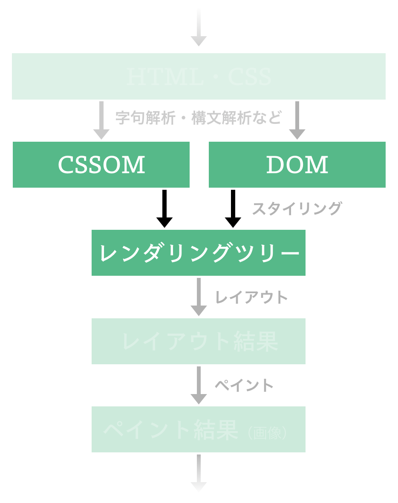

さて、DOM と CSSOM が手に入ったので、今度はそれらのツリーを画面に描画しやすい形に変形してやりましょう。



## レンダリングツリー

DOM と CSSOM は今の所独立して管理されているデータ構造ですから、画面に（CSS のスタイルを反映しつつ）DOM の内容を描画するのは若干面倒です。
そのため、多くの既存の Web ブラウザ実装は、一旦これらのデータ構造から **レンダリングツリー** と呼ばれるような中間構造を構築し、それをその先の画面描画のステップに利用しています。
また、このプロセスはしばじばスタイル（Style）と呼ばれています。

もっとも、レンダリングツリー自体は、何らかの Web 標準で定義されているものではありません。
しかし既存の Web ブラウザ実装間で、レンダリングツリー（やレンダリングのために構成されるデータの構造）はある程度共通しています。

例えば Blink 系ブラウザにおいてレンダリングツリーのノードを表す役割を持っている [LayoutObject](https://chromium.googlesource.com/chromium/blink/+/refs/heads/main/Source/core/layout/LayoutObject.h)[^webkit] は、以下のような形で DOM ツリー中の対応するノードと、スタイルに関する情報とを保持しています:

```cpp
// Quoted from https://chromium.googlesource.com/chromium/blink/+/refs/heads/main/Source/core/layout/LayoutObject.h
class CORE_EXPORT LayoutObject : public ImageResourceClient {
    /* ... */
    const ComputedStyle* style() const { return m_style.get(); }
    /* ... */
    UntracedMember<Node> node_;
    /* ... */
}
```

Servo においては以下に示す [`Fragment` オブジェクト](https://github.com/servo/servo/blob/master/components/layout/fragment.rs#L105-L110) が同じような役割を担っています[^servo_layout_detail]:

```rust
pub struct Fragment {
    /// An opaque reference to the DOM node that this `Fragment` originates from.
    pub node: OpaqueNode,

    /// The CSS style of this fragment.
    pub style: ServoArc<ComputedValues>,

    /* ... */
}
```

これらからは、およそレンダリングツリーは「DOM ツリー中の各ノードに、最低限それに対応する CSS プロパティを紐づけたもの」になっている、と言えるでしょう。

また ["Render-tree Construction, Layout, and Paint"](https://developers.google.com/web/fundamentals/performance/critical-rendering-path/render-tree-construction) によると、レンダリングツリーは、しばしば `display: none` プロパティが指定されたノードを含まないように構成されるようです。
実際 Blink 系ブラウザでは `LayoutObject` の生成に関連する `LayoutObject::createObject` において、[`display: none` プロパティを持った LayoutObject を生成しない](https://chromium.googlesource.com/chromium/blink/+/refs/heads/main/Source/core/layout/LayoutObject.cpp#188) ような処理が行われています。

[^webkit]: この `LayoutObject` は確か WebKit の [WebCore::RenderObject](https://trac.webkit.org/browser/webkit/trunk/Source/WebCore/rendering/RenderObject.h)）に由来しているような話をどこかで見た気がするのですが、思い出せず……
[^servo_layout_detail]: Servo の場合、`Fragment` オブジェクトの他に `Flow` オブジェクトもレンダリング処理において重要な役割を担っています。詳しくは [https://github.com/servo/servo/wiki/Layout-Overview](https://github.com/servo/servo/wiki/Layout-Overview) を参照してください。

## CSS と DOM の紐づけ

ここまでの内容を踏まえて、本章では、レンダリングツリーを「DOM ツリー中の各ノードに、最低限それに対応する CSS プロパティを紐づけたものであって、かつ `display: none` プロパティが指定されたノードが含まれないもの」と定義してやることにしましょう。

このとき、レンダリングツリーの構成における関心事は「DOM ツリー中の各ノードに関して、それに対応する CSS プロパティを紐づけるという操作をどう実現するか」になります。
いま、これに関して [CSS Cascading and Inheritance Level 3](https://www.w3.org/TR/css-cascade-3/) は、以下のような 3 つの重要なプロセスを定義しています:

- **filtering**
- **cascading**
- **defaulting**

### Filtering

このうち、[filtering](https://www.w3.org/TR/css-cascade-3/#filtering) は、DOM ツリー中の各ノードに対して、CSS 内の宣言のリストのうちそれに紐付いているもの（≒ [declared values](https://www.w3.org/TR/css-cascade-3/#declared-value)）を抽出するためのプロセスです。
このプロセスは、およそ「その要素にマッチするようなセレクタを持ったルール」を探してきたり、その宣言に関して [CSS Conditional Rules Module Level 3](https://www.w3.org/TR/css-conditional-3/) で規定されている条件が課せられている場合にそれをパスするかだったり、といった要素を加味しながら行われます。

### Cascading

しかし、filtering のステップで各ノードに対応する宣言を抽出していくと、DOM ツリー内の何らかのノードに関して、意味が衝突するような宣言が抽出されることがあります。DOM ツリー内のあるノードに対して `display: none` と `display: inline` の両方が指定されていた、といったようにです。

そんな重複を解消するためのプロセスが [cascading](https://www.w3.org/TR/css-cascade-3/#cascading) です。
Cascading のプロセスでは、[Cascade Origin](https://www.w3.org/TR/css-cascade-5/#origin) といった概念や CSS セレクタの [詳細度（specificity）](https://www.w3.org/TR/selectors-3/#specificity) という概念などをもとに宣言の間に優先順位を付けることで、衝突するような複数の宣言から [cascaded value](https://www.w3.org/TR/css-cascade-3/#cascaded-value) と呼ばれる実際に効力をもつ宣言を選択します。

### Defaulting

ただ、これまで説明した 2 つのプロセスを持ってしても、DOM ツリー内の各ノードが持ちうる全てのプロパティの値が決まるわけではないことに注意しなくてはいけません。
例えば `font-size` プロパティが明示的に指定されていない `p` タグの `font-size` プロパティの値としては、何を利用すればいいのかは、これらの 2 つのプロセスだけでは定かではありません。

この問題を解決するのが [defaulting](https://www.w3.org/TR/css-cascade-5/#defaulting) というプロセスです。このプロセスでは、タグの親子関係によりプロパティの値の [継承（inheritance）](https://www.w3.org/TR/css-cascade-3/#inheritance) や、プロパティごとに定義されている [初期値（initial value）](https://www.w3.org/TR/css-cascade-3/#initial-value) により値をより値を決めていきます。

> **:memo: User Agent Style Sheet**
>
> HTML Standard には [Rendering](https://html.spec.whatwg.org/multipage/rendering.html) という章が存在しており、ここには Web ブラウザ（等の User Agent）が HTML を解釈して、その中身を何らかの形で画面に表示するときの推奨事項が列挙されています。
> とりわけ、この章では **User Agent Style Sheet** という、原則基本的に全ての HTML 文書に適用したい CSS が定義されており、既存の Web ブラウザは実装をこれを元にした各ブラウザの固有のスタイルシートを内部に保持しています。
> 例えば Chromium 等の Blink 系では [third_party/blink/renderer/core/css/html.css](https://chromium.googlesource.com/chromium/blink/+/refs/heads/main/Source/core/css/html.css) が、Safari 等の WebKit 系では [Source/WebCore/css/html.css](https://trac.webkit.org/browser/trunk/Source/WebCore/css/html.css) が、Firefox では [mozilla-central/layout/style/res/html.css](https://searchfox.org/mozilla-central/source/layout/style/res/html.css) が User Agent Style Sheet として利用されています。

## 本章での実装方針

ここまでで説明した 3 つのプロセス（filtering, cascading, defaulting）により、DOM ツリー中の各ノードとそれに対応する CSS プロパティの紐づけは概ね達成することができそうです。
一方この全てを実装するのはこれまた骨が折れますから、本章ではミニマムなところとして、以下のような制約を設けつつ、レンダリングツリーの構築を実装してみることにします:

- cascading の際には ["order of appearance"](https://www.w3.org/TR/css-cascade-5/#cascade-order) のみを考慮する。
- defaulting は考慮しない。つまり継承の処理や初期値の指定は行わない[^display_property]。

[^display_property]: ちなみに、もともと ["CSS を取り扱う"](/chapters/parsing-css) の章で取り扱うことにした `display` プロパティは [デフォルトでは継承されない](https://drafts.csswg.org/css-display/#the-display-properties) ことことになっています。

この制約のうち、inheritance を考慮しないということに関しては、

## 実装

さて、例によって、ここからは手を動かしていく時間です:

> **:exclamation: 注意**
>
> 以降の内容では [The Rust Programming Language](https://doc.rust-lang.org/book/)（[邦訳版はこちら](https://doc.rust-jp.rs/book-ja/)） 程度の Rust の知識を仮定します。必要に応じて同文献を参照してください。
>
> また、実装で躓いた際には、[puppy の実装](https://github.com/lmt-swallow/puppy-browser/tree/6eec723d361527a5ec2dfafeb2dbd11bd4aba4a4) を参考にしてください。ここで説明している内容や演習用実装と、puppy の実装はほとんど同じようなものになっています。

> **:exclamation: 注意（セキュリティ・キャンプ全国大会 2021 オンライン参加者向け）**
>
> 実際のところ、ここから紹介するコードはあくまで講師の実装例でしかありませんから、1 から 10 まで事前学習期間に理解しようとしなくても大丈夫です。
> とくに理解できていなくても、2021/08/10 の講義はキャッチアップできるように設計されていますから、安心してくださいね。
>
> また、自分で手を動かして演習を進める場合でも、必ずしも以降のサンプル実装のように Rust を利用しなくても大丈夫です。
> 抽象的な部分（実装方針やテストケース、データ構造の定義例など）だけを参考にしつつ、自分の手慣れた言語で実装するのもよいでしょう。
> いずれにせよ無理のない程度に取り組んでください。

### 演習用実装のダウンロード

まずは以下のコマンドにより、この章のための **演習用実装** をダウンロードしてください。

```sh
git clone https://github.com/tiny-browserbook/exercise-rendering-tree
```

ここからは、この演習用実装内の全てのテストが成功する状態を目指します:
テストが全て成功する頃には、先述のような機能を持ったちいさな CSS 処理系が実装できているはずです。

[演習用の環境を構築する](/chapters/setup) で Rust や puppy が実行できる環境が整っていれば、ダウンロードしてきた `exercise-rendering-tree` ディレクトリ内で以下のようなコマンドを実行することで、事前に用意されているテストコードが実行できます。
まずは全てのテストが失敗していることを確認してください:

```sh
cargo test
```

### ゴールを確認する

ここまでの章では、DOM ツリーのノードを以下のような `Node` 構造体により表現していました:

```rust
pub struct Node {
    pub node_type: NodeType,
    pub children: Vec<Box<Node>>,
}
```

いま、演習用実装では、`Node` 構造体を拡張した `StyledNode` 構造体を `./src/style.rs` において定義しています:

```rust
/// `StyledNode` wraps `Node` with related CSS properties.
/// It forms a tree as `Node` does.
#[derive(Debug, PartialEq)]
pub struct StyledNode<'a> {
    pub node_type: &'a NodeType,
    pub children: Vec<StyledNode<'a>>,

    pub properties: HashMap<String, CSSValue>,
}
```

`StyledNode` 構造体は、およそ `Node` 構造体に「そのノードに適用される CSS プロパティの一覧」を付与したものであり、レンダリングツリーの要素を表現するデータ構造になっています。

いま、ある DOM ツリーの要素をレンダリングツリーの要素に変換する際、DOM ツリーの要素に `display: none` なる CSS プロパティが適用される場合には、その要素はレンダリングツリーに含められないのでした。
したがって、ここから開始する実装のゴールは「DOM ツリーを表現する `Node` オブジェクトと、CSSOM を表現する `Stylesheet` オブジェクトから適当な `Option<StyledNode>` オブジェクトを生成すること」と表現できます。
つまり、演習用実装中の `to_styled_node()` 関数に実装を与えることがこの章の最終地点です:

```rust
fn to_styled_node<'a>(node: &'a Box<Node>, stylesheet: &Stylesheet) -> Option<StyledNode<'a>> {
    todo!("you need to implement this");
}
```

### セレクタのマッチを実装する

先述の通り、レンダリングツリーの構成の際には、DOM ツリー内の各ノードと CSS ルールがマッチするかを順次確認していく必要があります。
となると、`Rule` オブジェクトと `Node` オブジェクトを受け取って「`Rule` オブジェクトが表現しているルールに当該 `Node` オブジェクトが表現するノードがマッチするか」を確認する関数を実装してやる必要がありそうです。

いま、そのような確認は「`Rule` オブジェクトの `selectors` フィールドの中に格納された `SimpleSelector` のうち、どれか 1 つでもマッチするものがあるか」の確認と等価です。
そこで、まずは `Rule` 構造体に以下のような `matches()` 関数を追加するところから始めましょう:

```rust
impl Rule {
    pub fn matches(&self, n: &Box<Node>) -> bool {
        self.selectors.iter().any(|s| s.matches(n))
    }
}
```

ここまで書き進めると、次に実装すべきは、`SimpleSelector` オブジェクトと `Node` オブジェクトを受け取って「当該 `SimpleSelector` オブジェクトが表現する simple selector が当該 `Node` オブジェクトが表現するノードにマッチするか」を確認する関数になります。
そこで、まずは手始めに、その関数を universal selector を表現する `SimpleSelector` オブジェクトと `Node` オブジェクトを受け取った際に真を返すような形で実装してみることにしましょう。
最低限演習用実装中の以下のようなテストコードがパスするように、`SimpleSelector` 構造体のもつ `matches()` 関数の実装を修正してみてください:

```rust
mod tests {
    /* ... */

    #[test]
    fn test_universal_selector_behaviour() {
        let e = &Element::new(
            "p".to_string(),
            [("id".to_string(), "test".to_string()),
            ("class".to_string(), "testclass".to_string())]
                .iter()
                .cloned()
                .collect(),
            vec![],
        );
        assert_eq!(SimpleSelector::UniversalSelector.matches(e), true);
    }

    /* ... */
}
```

いま、最低限上記のテストコードがパスするような実装としては、以下のようなものが考えられます:

```rust
pub enum SimpleSelector {
    /* ... */
}

impl SimpleSelector {
    pub fn matches(&self, n: &Box<Node>) -> bool {
        match self {
            SimpleSelector::UniversalSelector => true,
            _ => false
        }
    }
}
```

`matches()` 関数の修正を終えたら `cargo test` コマンドを実行してみてください。
これで `test_universal_selector_behaviour` なるテストケースがパスすることが確認できたら、第一関門はクリアです。

ここまで出来たら、今度は以下の 3 つのテストケースもパスするように、同じく `SimpleSelector` 構造体の `matches()` 関数を修正してみてください:

```rust
mod tests {
    /* ... */

    #[test]
    fn test_type_selector_behaviour() {
        let e = &Element::new(
            "p".to_string(),
            [("id".to_string(), "test".to_string()),
            ("class".to_string(), "testclass".to_string())]
                .iter()
                .cloned()
                .collect(),
            vec![],
        );

        assert_eq!(
            (SimpleSelector::TypeSelector {
                tag_name: "p".into(),
            })
            .matches(e),
            true
        );

        assert_eq!(
            (SimpleSelector::TypeSelector {
                tag_name: "invalid".into(),
            })
            .matches(e),
            false
        );
    }

    #[test]
    fn test_attribute_selector_behaviour() {
        let e = &Element::new(
            "p".to_string(),
            [("id".to_string(), "test".to_string()),
            ("class".to_string(), "testclass".to_string())]
                .iter()
                .cloned()
                .collect(),
            vec![],
        );

        assert_eq!(
            (SimpleSelector::AttributeSelector {
                tag_name: "p".into(),
                attribute: "id".into(),
                value: "test".into(),
                op: AttributeSelectorOp::Eq,
            })
            .matches(e),
            true
        );

        assert_eq!(
            (SimpleSelector::AttributeSelector {
                tag_name: "p".into(),
                attribute: "id".into(),
                value: "invalid".into(),
                op: AttributeSelectorOp::Eq,
            })
            .matches(e),
            false
        );

        assert_eq!(
            (SimpleSelector::AttributeSelector {
                tag_name: "p".into(),
                attribute: "invalid".into(),
                value: "test".into(),
                op: AttributeSelectorOp::Eq,
            })
            .matches(e),
            false
        );

        assert_eq!(
            (SimpleSelector::AttributeSelector {
                tag_name: "invalid".into(),
                attribute: "id".into(),
                value: "test".into(),
                op: AttributeSelectorOp::Eq,
            })
            .matches(e),
            false
        );
    }

    #[test]
    fn test_class_selector_behaviour() {
        let e = &Element::new(
            "p".to_string(),
            [("id".to_string(), "test".to_string()),
            ("class".to_string(), "testclass".to_string())]
                .iter()
                .cloned()
                .collect(),
            vec![],
        );

        assert_eq!(
            (SimpleSelector::ClassSelector {
                class_name: "testclass".into(),
            })
            .matches(e),
            true
        );

        assert_eq!(
            (SimpleSelector::ClassSelector {
                class_name: "invalid".into(),
            })
            .matches(e),
            false
        );
    }

    /* ... */
}
```

愚直に実装するなら、例えば先ほどの実装を以下のように修正してみるとよいでしょう:

```rust
impl SimpleSelector {
    pub fn matches(&self, n: &Box<Node>) -> bool {
        match self {
            SimpleSelector::UniversalSelector => true,
            SimpleSelector::TypeSelector { tag_name } => match n.node_type {
                NodeType::Element(ref e) => e.tag_name.as_str() == tag_name,
                _ => false,
            },
            SimpleSelector::AttributeSelector {
                tag_name,
                op,
                attribute,
                value,
            } => match n.node_type {
                NodeType::Element(ref e) => {
                    e.tag_name.as_str() == tag_name
                        && match op {
                            AttributeSelectorOp::Eq => e.attributes.get(attribute) == Some(value),
                            AttributeSelectorOp::Contain => e
                                .attributes
                                .get(attribute)
                                .map(|value| {
                                    value
                                        .split_ascii_whitespace()
                                        .find(|v| v == value)
                                        .is_some()
                                })
                                .unwrap_or(false),
                        }
                }
                _ => false,
            },
            SimpleSelector::ClassSelector { class_name } => match n.node_type {
                NodeType::Element(ref e) => e.attributes.get("class") == Some(class_name),
                _ => false,
            },
        }
    }
}
```

上記のような修正を加えた上で、改めて `cargo test` コマンドを実行してみましょう。
先述の 3 つのテストがパスするようになっていれば OK です。

### DOM ツリーを変換する

ここまでの実装により、「`Rule` オブジェクトが表現しているルールに当該 `Node` オブジェクトが表現するノードがマッチするか」が確認できるようになりました。
一旦本章ではスタイルの詳細度や継承などの処理は無視することにするのでしたから、もう残る仕事は `Node` オブジェクトと `Stylesheet` オブジェクトから `Option<StyledNode>` オブジェクトを生成することだけです。
いざ演習用実装中の `to_styled_node` 関数に実装を与えてみてください:

```rust
fn to_styled_node<'a>(node: &'a Box<Node>, stylesheet: &Stylesheet) -> Option<StyledNode<'a>> {
    todo!("you need to implement this");
}
```

例えば、この関数の愚直な実装としては、以下のようなものが考えられます:

```rust
fn to_styled_node<'a>(node: &'a Box<Node>, stylesheet: &Stylesheet) -> Option<StyledNode<'a>> {
    let mut properties: HashMap<String, CSSValue> = [].iter().cloned().collect();

    // order of appearance のみを考慮した filtering & cascading
    for matched_rule in stylesheet.rules.iter().filter(|r| r.matches(node)) {
        for declaration in &matched_rule.declarations {
            properties.insert(declaration.name.clone(), declaration.value.clone());
        }
    }

    // defaulting は一旦考慮しないことにしていたのでスキップ

    // display: none が指定されているノードはレンダリングツリーに含めない
    if properties.get("display") == Some(&CSSValue::Keyword("none".into())) {
        return None;
    }

    let children = node
        .children
        .iter()
        .filter_map(|x| to_styled_node(x, stylesheet))
        .collect();

    Some(StyledNode {
        node_type: &node.node_type,
        properties,
        children,
    })
}
```

実装ができたら `cargo test` コマンドを実行し、全てのテストケースがパスしているかを確認してください。
パスしていれば、この章で取り扱っていたレンダリングツリーに関する実装は完了です。

> **:muscle: 発展演習: `display` プロパティの初期値を指定する**
>
> `display` プロパティの仕様上の初期値が何かを突き止め、つねに `StyledNode` オブジェクトが常に `display` プロパティの値を持つように実装を修正してみましょう。

> **:muscle: 発展演習: `font-weight` プロパティを Defaulting つきで実装する**
>
> `font-weight` プロパティの仕様上の初期値を調べ、つねに `StyledNode` オブジェクトが常に `font-weight` プロパティの値を持つように実装を修正してみましょう。
> また、`font-weight` プロパティが親子関係のあるタグ間で継承されるべきかも調べ、継承されるべきだった場合はその継承処理も実装してみましょう。

> **:muscle: 発展演習: 詳細度を考慮した Cascading を実装する**
>
> 実のところ、 ["CSS を取り扱う"](/chapters/parsing-css) で取り扱った程度の CSS ルールに対して詳細度の計算を行うのは難しくありません。
> 意欲のある方は、["Calculating a selector's specificity"](https://www.w3.org/TR/selectors-3/#specificity) を参照しながら、詳細度を考慮した Cascading を実装してみてください。

## ふりかえり

本章ではレンダリングツリーの構築のために必要な作業について概説した後、レンダリングツリーを構成する処理を大まかに実装しました。
これにて HTML 文字列や CSS 文字列から、純粋に画面に描画されるべき情報だけを取り出すことができたことになります。
画面に情報を出力できるようになるのももうすぐです！
