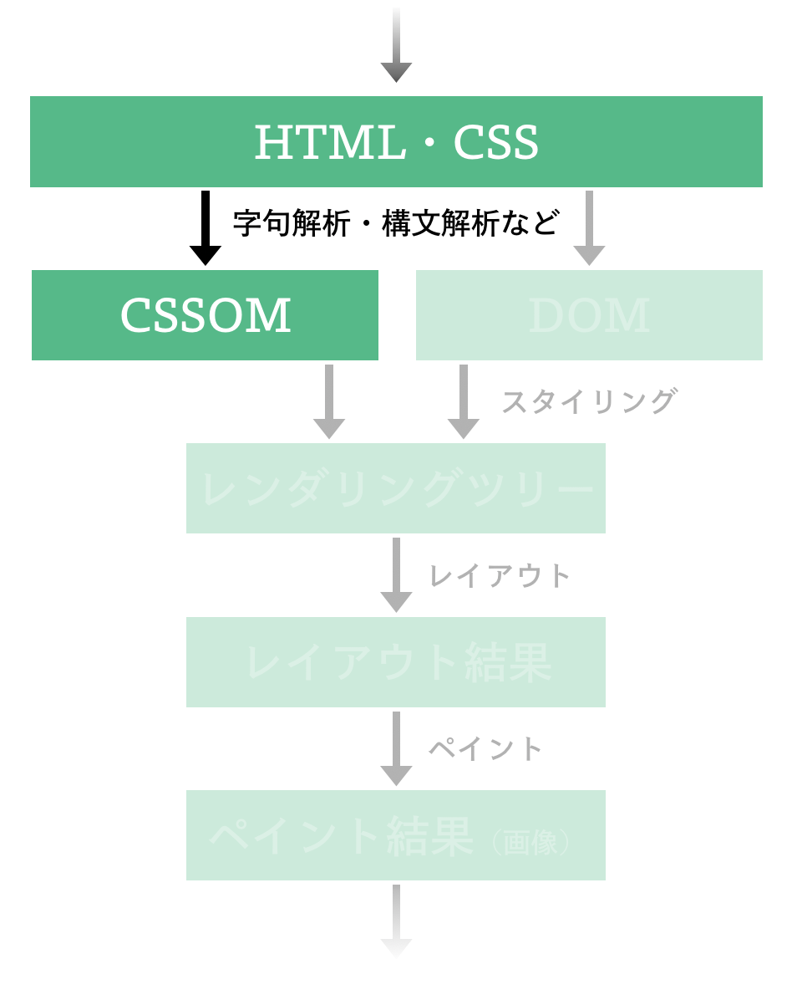

HTML を DOM ツリーに変換する処理が実装できたら、次は CSS を取り扱う処理を実装しましょう。



## CSS の仕様

前の章（["HTML を取り扱う"](/chapters/parsing-html) ）で登場した Web 標準の多くは **WHATWG** という団体により管理されているものでした。
一方、CSS に関する Web 標準の多くは **W3C** という団体により管理されています。

CSS に関する標準は、機能単位ごとに分割された形で管理されているのも特徴的です。
たとえば CSS Fonts に関する仕様は ["CSS Fonts Module"](https://www.w3.org/TR/css-fonts-3/) で、CSS のセレクタ（後述）に関する仕様は ["Selectors"](https://www.w3.org/TR/selectors-3/) で管理されています。

もっとも、このような運用には「どの仕様が現状で安定したものであるかが分かりにくい」「どのような仕様が存在しているのかが分かりにくい」といった課題があるのも事実です。
そのため、近年は "CSS Snapshot 20XX" のような名称の文書が定期的に発行されており、この文書により CSS に関する Web 標準のうち一定安定しているものが一覧できるようになっています。

さらに詳しく CSS 標準に関する動きが知りたい方は、W3C が [CSS 標準に関するポータルページ](https://www.w3.org/Style/CSS/) を運営していますので、是非同ポータルページを参照してください。

## 基礎的な概念

CSS のスタイルシートは複数の **ルール** からなります。
例えば次の CSS は、`@charset "utf-8"` のように `@` から始まる [at-rule](https://www.w3.org/TR/css-syntax-3/#at-rule) と呼ばれるルールと、それ以降の [qualified rule](https://www.w3.org/TR/css-syntax-3/#qualified-rule) ないしは [style rule](https://www.w3.org/TR/css-syntax-3/#style-rules) と呼ばれるルールから構成されています:

```css
/* 以下は at-rule */
@charset "utf-8";

/* 以下は qualified rule (style rule) */
*.warning > input[type="password"],
*.warning > input[type="text"] {
  width: 100px;
  height: 32px;
}

/* 以下も qualified rule (style rule) */
div ~ p {
  width: 100px;
}
```

簡単のために qualified rule と style rule を同一視することにすると、CSS のスタイルシートというのは、大まかに以下のようなデータ構造で表現できることになります:

```rust
#[derive(Debug, PartialEq)]
struct Stylesheet {
    pub rules: Vec<Rule>,
}

enum Rule {
    AtRule(AtRule),
    QualifiedRule(QualifiedRule),
}

// 厳密には異なるが、一旦ここでは同一視する
type StyleRule = QualifiedRule;
```

いま、[at-rule](https://www.w3.org/TR/css-syntax-3/#at-rule) は CSS そのものの振る舞いについてを規定する用途で用いられているルールです。
具体的には `@charset ...` や `@import ...`、`@page ...` といったような指定が存在しています。

一方、[style rule](https://www.w3.org/TR/css-syntax-3/#style-rules) は、およそ style rule は「どんな対象（とくにどんな HTML 要素）に、どんなスタイルを指定するか」を表現するルールです。

もう少し [CSS Syntax Module Level 3](https://www.w3.org/TR/css-syntax-3) や [Selectors Level 3](https://www.w3.org/TR/selectors-3/) に従ってこれを細かく説明するならば、style rule は `*.warning > input[type="password"], *.warning > input[type="text"]` のような [**comma-separated list of selectors**](https://www.w3.org/TR/selectors-3/#grouping) と、`width: 100px` や `height: 32px;` のような **宣言（declaration）** と呼ばれるもののリスト（declaration list）からなります。

```css
<comma-separated list of selectors> {
    <declaration>;
    <declaration>;
    /* ... */
}
```

いま、**comma-separated list of selectors** というものは、コンマ区切りの **selector** からなる列のことです。

```css
<selector>, <selector>, ...  {
    <declaration>;
    <declaration>;
    /* ... */
}
```

このセレクタ − は **combinator** により区切られた 1 つ以上の **sequence of simple selectors** からなるものです。

```css
<simple selector> <combinator> <simple selector>,
<simple selector>,
...  {
    <declaration>;
    <declaration>;
    /* ... */
}
```

**sequence of simple selectors** の各要素である **simple selector** には [**universal selector**](https://www.w3.org/TR/selectors-3/#universal-selector) や [**attribute selector**](https://www.w3.org/TR/selectors-3/#attribute-selectors) といったいくつかの種類からなります。

```css
<universal selector> <combinator> <attribute selector>,
<type selector>,
...  {
    <declaration>;
    <declaration>;
    /* ... */
}
```

なんだかややこしいですが、style rule というのは、およそ以下のような構造をしているというわけです:

```rust
struct StyleRule {
    pub selectors: CommaSeparatedSelectorList,
    pub declarations: Vec<Declaration>,
}

type CommaSeparatedSelectorList = Vec<SimpleSelectorSequence>;

type SimpleSelectorSequence = CombinatedSimpleSelector;

enum CombinatedSelectorSequence {
    Descendant(SimpleSelector, Box<CombinatedSelectorSequence>),
    Child(SimpleSelector, Box<CombinatedSelectorSequence>),
    Sibiling(SimpleSelector, Box<CombinatedSelectorSequence>),
    Tail(SimpleSelector)
}

pub struct SimpleSelector { /* ... */ }
pub enum SimpleSelector {
    UniversalSelector,
    TypeSelector {
        tag_name: String,
    },
    AttributeSelector {
        tag_name: String,
        op: AttributeSelectorOp,
        attribute: String,
        value: String,
    },
    ClassSelector {
        class_name: String,
    },
    /* and more ... */
}
```

> :memo: CSS Selectors Level 4
>
> CSS Selectors Level 3 ではセレクタをここまでで説明したように定義しています。
> 一方、CSS Selectors Level 4 ではこれとはまた違った語の定義が行われていることに注意してください。
> 例えば CSS Selectors Level 3 でいう "comma-separated list of selectors" には ["selector list"](https://www.w3.org/TR/selectors-4/#selector-list) という名前がつけられています。
> また combinator により結合された simple selector の列には **complex selector** という名前が、本章で説明でいう sequence of simple selectors には **compound selector** という名前が与えられています。
> さらに selector という語は、**simple selector・compound selector・complex selector・selector list を指す語** として定義してされています。

## CSS のパース処理の概略

CSS Syntax Level 3 の [Tokenizing and Parsing CSS](https://drafts.csswg.org/css-syntax/#tokenizing-and-parsing) で述べられている通り、CSS のパース処理においては、およそ以下の 3 つが行われています:

1. バイト列をトークナイザ（tokernizer; 字句解析器）の入力に変換する
2. **Tokenization stage**: 前の手順の出力をトークナイザでトークン列に変換する
3. **Tree construction stage**: 前の手順の出力から `CSSStyleSheet` オブジェクトを構築する

もっとも、HTML のパース処理と比べると、CSS のパース処理の難易度はそう高くありません。
例外処理がそう多いわけでもなければ、後方互換性の維持のために設けられている歪な仕様も少ないためです。

> **:memo: コラム: 既存 Web ブラウザでの実装例**
>
> 筆者の知る限り、Firefox の Servo は CSS の処理のために `rust-cssparser` クレートを開発・利用しており、このクレートは [servo/servo](https://github.com/servo/servo) の [`components::style`](https://github.com/servo/servo/tree/f5c02966494e3386a6492b5beb38894819aed81c/components/style) を始めとした各所で用いられています。
>
> Chromium の Blink の場合 [third_party/blink/renderer/core/css/css_selector.h](https://chromium.googlesource.com/chromium/blink/+/refs/heads/main/Source/core/css/parser/CSSParser.cpp) 周辺に HTML のパースに関連する処理の実装が存在しています。

## 本章での実装方針

HTML より処理が簡単とはいえど、CSS Syntax Level 3 の通りに全てを実装するのは骨が折れる作業です。
そこで本章では、以下のような CSS ルールを複数持つスタイルシートを表す文字列を処理することを目指します:

- 宣言内には [CSS Display Module Level 3](https://drafts.csswg.org/css-display/#the-display-properties) で定義されている `display` プロパティのみを持つ。
- セレクタ部分には次のような種類のセレクタの（コンマ区切りの）列を持つ:
  - [Universal Selector](https://www.w3.org/TR/selectors-3/#universal-selector)
  - [Class Selector](https://www.w3.org/TR/selectors-3/#class-html)
  - [Type Selector](https://www.w3.org/TR/selectors-3/#type-selectors)
  - [Attribute Selector](https://www.w3.org/TR/selectors-3/#attribute-selectors)

これらに対応すると、およそ、以下のような CSS が取り扱えるようになるはずです:

```css
* {
  display: inline;
}

.aaa {
  display: none;
}

i,
a {
  display: inline;
}

span[attr="test"] {
  display: inline;
}
```

> 逆に、ここでは `>` や `*` などの [Combinator](https://www.w3.org/TR/selectors-3/#combinators) には対応しないことにします。
> もしこれらのセレクタに対応する場合や、`font-size` のような子要素にまで影響が波及するようなプロパティを取り扱う必要が出てきた際には、["Constructing the Object Model | Web Fundamentals | Google Developers"](https://developers.google.com/web/fundamentals/performance/critical-rendering-path/constructing-the-object-model?hl=ja) で紹介されているような木構造を持ったデータ構造を新たに定義してやる必要があることでしょう。

## 実装

さて、いよいよ実装に入りましょう。

> **:exclamation: 注意**
>
> 以降の内容では [The Rust Programming Language](https://doc.rust-lang.org/book/)（[邦訳版はこちら](https://doc.rust-jp.rs/book-ja/)） 程度の Rust の知識を仮定します。必要に応じて同文献を参照してください。
>
> また、実装で躓いた際には、[puppy の実装](https://github.com/lmt-swallow/puppy-browser/tree/6eec723d361527a5ec2dfafeb2dbd11bd4aba4a4) を参考にしてください。ここで説明している内容や演習用実装と、puppy の実装はほとんど同じようなものになっています。

> **:exclamation: 注意（セキュリティ・キャンプ全国大会 2021 オンライン参加者向け）**
>
> 実際のところ、ここから紹介するコードはあくまで講師の実装例でしかありませんから、1 から 10 まで事前学習期間に理解しようとしなくても大丈夫です。
> とくに理解できていなくても、2021/08/10 の講義はキャッチアップできるように設計されていますから、安心してくださいね。
>
> また、自分で手を動かして演習を進める場合でも、必ずしも以降のサンプル実装のように Rust を利用しなくても大丈夫です。
> 抽象的な部分（実装方針やテストケース、データ構造の定義例など）だけを参考にしつつ、自分の手慣れた言語で実装するのもよいでしょう。
> いずれにせよ無理のない程度に取り組んでください。

### 演習用実装をダウンロードする

具体的には、以下のコマンドによりダウンロードできる **演習用実装** に関して、その全てのテストが成功する状態を目指します:

```sh
git clone https://github.com/tiny-browserbook/exercise-css
```

このテストが全て成功した頃には、先述のような機能を持ったちいさな CSS 処理系が実装できているはずです。

[演習用の環境を構築する](/chapters/setup) で Rust や puppy が実行できる環境が整っていれば、ダウンロードしてきた `exercise-css` ディレクトリ内で以下のようなコマンドを実行することで事前に用意されているテストコードが実行できます。
まずは全てのテストが失敗していることを確認してください:

```sh
cargo test
```

### ゴールを確認する

演習用実装では、これから実装する CSS 処理系の出力となるデータ構造を、`./src/css.rs` において次のように定義しています:

```rust
`/// `Stylesheet` represents a single stylesheet.
/// It consists of multiple rules, which are called "rule-list" in the standard (https://www.w3.org/TR/css-syntax-3/).
#[derive(Debug, PartialEq)]
pub struct Stylesheet {
    pub rules: Vec<Rule>,
}

/// `Rule` represents a single CSS rule.
#[derive(Debug, PartialEq)]
pub struct Rule {
    pub selectors: Vec<Selector>, // a comma-separated list of selectors
    pub declarations: Vec<Declaration>,
}

/// NOTE: This is not compliant to the standard for simplicity.
///
/// In the standard, *a selector* is *a chain* of one or more sequences of simple selectors separated by combinators,
/// where a sequence of simple selectors is a chain of simple selectors that are not separated by a combinator.
/// Hence `Selector` is in fact something like `Vec<Vec<SimpleSelector>>`.
pub type Selector = SimpleSelector;

/// `SimpleSelector` represents a simple selector defined in the following standard:
/// https://www.w3.org/TR/selectors-3/#selector-syntax
#[derive(Debug, PartialEq)]
pub enum SimpleSelector {
    UniversalSelector,
    TypeSelector {
        tag_name: String,
    },
    AttributeSelector {
        tag_name: String,
        op: AttributeSelectorOp,
        attribute: String,
        value: String,
    },
    ClassSelector {
        class_name: String,
    },
    // TODO (enhancement): support multiple attribute selectors like `a[href=bar][ping=foo]`
    // TODO (enhancement): support more attribute selectors
}

/// `AttributeSelectorOp` is an operator which is allowed to use.
/// See https://www.w3.org/TR/selectors-3/#attribute-selectors to check the full list of available operators.
#[derive(Debug, PartialEq)]
pub enum AttributeSelectorOp {
    Eq,      // =
    Contain, // ~=
}

/// `Declaration` represents a CSS declaration defined at [CSS Syntax Module Level 3](https://www.w3.org/TR/css-syntax-3/#declaration)
///
/// Declarations are further categorized into the followings:
/// - descriptors, which are mostly used in "at-rules" like `@foo (bar: piyo)` https://www.w3.org/Style/CSS/all-descriptors.en.html
/// - properties, which are mostly used in "qualified rules" like `.foo {bar: piyo}` https://www.w3.org/Style/CSS/all-descriptors.en.html
///
/// For simplicity, we handle two types of declarations together.
#[derive(Debug, PartialEq)]
pub struct Declaration {
    pub name: String,
    pub value: CSSValue,
    // TODO (enhancement): add a field for `!important`
}

/// `CSSValue` represents some of *component value types* defined at [CSS Values and Units Module Level 3](https://www.w3.org/TR/css-values-3/#component-types).
#[derive(Debug, PartialEq, Clone)]
pub enum CSSValue {
    Keyword(String),
}`
```

ここからは CSS 文字列をこのようなデータ構造に従うデータに変換していきます。

### 宣言（declaration）

まずは `.test { display: none; }` のような CSS 文字列の中の `display: none` の部分をパースするところを実装してみましょう。
以下のようなテストコードがパスするように `declarations()` 関数の実装を変更してみてください:

```rust
mod tests {
    /* ... */

    fn test_declarations() {
        assert_eq!(
            declarations().parse("foo: bar; piyo: piyopiyo;"),
            Ok((
                vec![
                    Declaration {
                        name: "foo".to_string(),
                        value: CSSValue::Keyword("bar".to_string())
                    },
                    Declaration {
                        name: "piyo".to_string(),
                        value: CSSValue::Keyword("piyopiyo".to_string())
                    }
                ],
                ""
            ))
        );
    }

    /* ... */
}
```

いま、[CSS Syntax Module Level 3 中のこの図](https://www.w3.org/TR/css-syntax-3/#declaration-diagram) の通り、宣言はプロパティ名と値が `:` で区切られた形で記述されます[^value_types]。
これを愚直に combine クレートを用いた実装に落とすと以下のようになるでしょう:

```rust
fn css_value<Input>() -> impl Parser<Input, Output = CSSValue>
where
    Input: Stream<Token = char>,
    Input::Error: ParseError<Input::Token, Input::Range, Input::Position>,
{
    let keyword = many1(letter()).map(|s| CSSValue::Keyword(s));
    keyword
}

fn declaration<Input>() -> impl Parser<Input, Output = Declaration>
where
    Input: Stream<Token = char>,
    Input::Error: ParseError<Input::Token, Input::Range, Input::Position>,
{
    (
        many1(letter()).skip(whitespaces()),
        char::char(':').skip(whitespaces()),
        css_value(),
    )
        .map(|(k, _, v)| Declaration { name: k, value: v })
}

fn declarations<Input>() -> impl Parser<Input, Output = Vec<Declaration>>
where
    Input: Stream<Token = char>,
    Input::Error: ParseError<Input::Token, Input::Range, Input::Position>,
{
    sep_end_by(
        declaration().skip(whitespaces()),
        char::char(';').skip(whitespaces()),
    )
}
```

実際にこのように `declarations()` 関数などの実装を修正すると、`test_declarations` というテストケースが成功するようになるはずです。
これで宣言が取り扱えるようになりました。

[^value_types]: 宣言中の値の種類としては、[CSS Values and Units Module Level 4](https://www.w3.org/TR/css-values-4/) で定義されているようなものが存在します。ここでは `display` プロパティのみしか取り扱わないことにしていましたから、一旦は宣言中の値としては [keyword](https://www.w3.org/TR/css-values-4/#keywords) が来ることを期待することにしています。

### セレクタ（selector）

次は `.test { display: none; }` のような CSS 文字列の中の `.test` の部分を取り扱うための処理を実装しましょう。
次のようなテストコードがパスするように `simple_selector()` 関数や `selectors()` 関数の定義を修正してみてください:

```rust
mod tests {
    /* ... */

    #[test]
    fn test_selectors() {
        assert_eq!(
            selectors().parse("test [foo=bar], a"),
            Ok((
                vec![
                    SimpleSelector::AttributeSelector {
                        tag_name: "test".to_string(),
                        attribute: "foo".to_string(),
                        op: AttributeSelectorOp::Eq,
                        value: "bar".to_string()
                    },
                    SimpleSelector::TypeSelector {
                        tag_name: "a".to_string(),
                    }
                ],
                ""
            ))
        );
    }

    #[test]
    fn test_simple_selector() {
        assert_eq!(
            simple_selector().parse("*"),
            Ok((SimpleSelector::UniversalSelector, ""))
        );

        assert_eq!(
            simple_selector().parse("test"),
            Ok((
                SimpleSelector::TypeSelector {
                    tag_name: "test".to_string(),
                },
                ""
            ))
        );

        assert_eq!(
            simple_selector().parse("test [foo=bar]"),
            Ok((
                SimpleSelector::AttributeSelector {
                    tag_name: "test".to_string(),
                    attribute: "foo".to_string(),
                    op: AttributeSelectorOp::Eq,
                    value: "bar".to_string()
                },
                ""
            ))
        );

        assert_eq!(
            simple_selector().parse(".test"),
            Ok((
                SimpleSelector::ClassSelector {
                    class_name: "test".to_string(),
                },
                ""
            ))
        );
    }

    /* ... */
}
```

以下に愚直な実装例を示します:

```rust
fn selectors<Input>() -> impl Parser<Input, Output = Vec<Selector>>
where
    Input: Stream<Token = char>,
    Input::Error: ParseError<Input::Token, Input::Range, Input::Position>,
{
    sep_by(
        simple_selector().skip(whitespaces()),
        char::char(',').skip(whitespaces()),
    )
}

fn simple_selector<Input>() -> impl Parser<Input, Output = SimpleSelector>
where
    Input: Stream<Token = char>,
    Input::Error: ParseError<Input::Token, Input::Range, Input::Position>,
{
    let universal_selector = char::char('*').map(|_| SimpleSelector::UniversalSelector);
    let class_selector =
        (char::char('.'), many1(letter())).map(|(_, class_name)| SimpleSelector::ClassSelector {
            class_name: class_name,
        });
    let type_or_attribute_selector = (
        many1(letter()).skip(whitespaces()),
        optional((
            char::char('[').skip(whitespaces()),
            many1(letter()),
            choice((char::string("="), char::string("~="))),
            many1(letter()),
            char::char(']'),
        )),
    )
        .and_then(|(tag_name, opts)| match opts {
            Some((_, attribute, op, value, _)) => {
                let op = match op {
                    "=" => AttributeSelectorOp::Eq,
                    "~=" => AttributeSelectorOp::Contain,
                    _ => {
                        return Err(<Input::Error as combine::error::ParseError<
                            char,
                            Input::Range,
                            Input::Position,
                        >>::StreamError::message_static_message(
                            "invalid attribute selector op",
                        ))
                    }
                };
                Ok(SimpleSelector::AttributeSelector {
                    tag_name: tag_name,
                    attribute: attribute,
                    op: op,
                    value: value,
                })
            }
            None => Ok(SimpleSelector::TypeSelector { tag_name: tag_name }),
        });

    choice((
        universal_selector,
        class_selector,
        type_or_attribute_selector,
    ))
}
```

実際にこのように `selectors()` 関数などの実装を修正すると、`test_selectors` と `test_simple_selector` というテストケースが成功するようになるはずです。これでセレクタも取り扱えるようになりました。

### ルール（Rule）

宣言とセレクタが処理できるようになったので、今度はルールを処理できるようにしましょう。
以下のようなテストコードがパスするように `rule()` 関数の定義を修正してください：

```rust
mod tests {
    /* ... */

#[test]
    fn test_rule() {
        assert_eq!(
            rule().parse("test [foo=bar] {}"),
            Ok((
                Rule {
                    selectors: vec![SimpleSelector::AttributeSelector {
                        tag_name: "test".to_string(),
                        attribute: "foo".to_string(),
                        op: AttributeSelectorOp::Eq,
                        value: "bar".to_string()
                    }],
                    declarations: vec![]
                },
                ""
            ))
        );

        assert_eq!(
            rule().parse("test [foo=bar], testtest[piyo~=guoo] {}"),
            Ok((
                Rule {
                    selectors: vec![
                        SimpleSelector::AttributeSelector {
                            tag_name: "test".to_string(),
                            attribute: "foo".to_string(),
                            op: AttributeSelectorOp::Eq,
                            value: "bar".to_string()
                        },
                        SimpleSelector::AttributeSelector {
                            tag_name: "testtest".to_string(),
                            attribute: "piyo".to_string(),
                            op: AttributeSelectorOp::Contain,
                            value: "guoo".to_string()
                        }
                    ],
                    declarations: vec![]
                },
                ""
            ))
        );

        assert_eq!(
            rule().parse("test [foo=bar] { aa: bb; cc: dd; }"),
            Ok((
                Rule {
                    selectors: vec![SimpleSelector::AttributeSelector {
                        tag_name: "test".to_string(),
                        attribute: "foo".to_string(),
                        op: AttributeSelectorOp::Eq,
                        value: "bar".to_string()
                    }],
                    declarations: vec![
                        Declaration {
                            name: "aa".to_string(),
                            value: CSSValue::Keyword("bb".to_string())
                        },
                        Declaration {
                            name: "cc".to_string(),
                            value: CSSValue::Keyword("dd".to_string()),
                        }
                    ]
                },
                ""
            ))
        );
    }


    /* ... */
}
```

以下に愚直な実装例を示します:

```rust
fn rule<Input>() -> impl Parser<Input, Output = Rule>
where
    Input: Stream<Token = char>,
    Input::Error: ParseError<Input::Token, Input::Range, Input::Position>,
{
    (
        selectors().skip(whitespaces()),
        char::char('{').skip(whitespaces()),
        declarations().skip(whitespaces()),
        char::char('}'),
    )
        .map(|(selectors, _, declarations, _)| Rule {
            selectors,
            declarations,
        })
}
```

これで CSS のルールが取り扱えるようになりました。

### スタイルシート（Stylesheet）

最後にルールの列を `Stylesheet` という構造体に格納する処理を実装しましょう。
以下のようにです:

```rust
pub fn parse(raw: String) -> Stylesheet {
    rules()
        .parse(raw.as_str())
        .map(|(rules, _)| Stylesheet::new(rules))
        .unwrap()
}

fn rules<Input>() -> impl Parser<Input, Output = Vec<Rule>>
where
    Input: Stream<Token = char>,
    Input::Error: ParseError<Input::Token, Input::Range, Input::Position>,
{
    (whitespaces(), many(rule().skip(whitespaces()))).map(|(_, rules)| rules)
}
```

これで CSS 文字列に関する基礎的な処理が一通り実装できました！

## ふりかえり

本章では CSS の仕様について説明した後、そのパース処理を実装しました。
前の章（["HTML を取り扱う"](/chapters/parsing-html)）のこの章の内容を合わせると、これでレンダリングツリーを構成するのに必要な処理が揃ったことになります。
