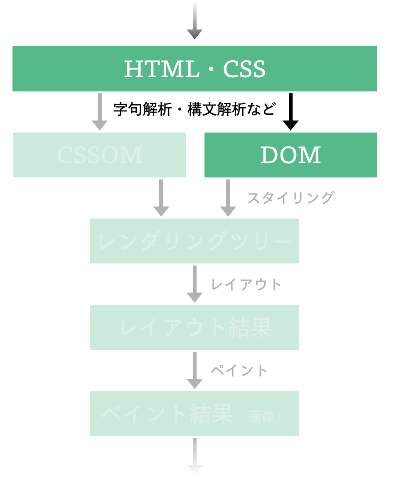

Part 1 では次のような HTML をターミナル内で表示できる Web ブラウザを作ることを目指しているのでした:

```html
<body>
  <p>hello</p>
  <div class="inlinediv">
    <p>world</p>
  </div>
  <div class="none">
    <p>this should not be shown</p>
  </div>
  <style>
    .none {
      display: none;
    }
  </style>
</body>
```

この目標の実現のために、まずは HTML の**パース処理**（HTML 文字列を DOM のようなツリーに変換する処理）を実装するところから始めましょう。
つまり、本章で取り扱うのは、Part 1 で取り扱う項目のうち次の図が示す部分です:



本章では、HTML を取り扱う処理を実装する前に、この節では、HTML や DOM の仕様を概説します。
その上で本オンラインブックでの実装方針や実装例の説明をします。

## HTML と DOM

本オンラインブックの執筆時点において、HTML の仕様は WHATWG が管理する [HTML Standard](https://html.spec.whatwg.org/) において管理されており、DOM の仕様は [DOM Standard](https://dom.spec.whatwg.org/) で管理されています[^spec_history]。
これらの Web 標準は日々更新が行われていますが、「バージョン 1.0.x」といったようなバージョニングはなされておらず、常にその時に公開されているものが正とされています。
このようなスタイルの Web 標準は **Living Standard** と呼ばれています。

HTML Standard や DOM Standard に関する議論は [whatwg/html](https://github.com/whatwg/html) や [whatwg/dom](https://github.com/whatwg/dom) で行われています。この議論の様子は誰でも覗くことができますし、議論に参加することに対する制限もありません。

> **:muscle: 演習: HTML Standard の議論を覗いてみよう**
>
> [whatwg/html の Issues](https://github.com/whatwg/html/issues) を開いて、現在 HTML Standard の周辺でどのような議論が行われているのかを調べてみましょう。

[^spec_history]: かつて HTML / DOM の仕様は別の団体により管理されていたり、並行して 2 つの仕様が存在していたりしました。そういった仕様そのものの歴史は [HTML Living Standard の History という節](https://html.spec.whatwg.org/multipage/introduction.html#history-2) に詳しく述べられていますし、特に初期のことは ["Weaving the Web: The Original Design and Ultimate Destiny of the world Wide Web"](https://www.w3.org/People/Berners-Lee/Weaving/) を始めとした当事者の自伝でも語られていますから、興味のある方はそれらの文献に手を伸ばしてみてください。

## HTML のパース処理の概略

HTML Standard の ["Overview of the parsing model"](https://html.spec.whatwg.org/multipage/parsing.html#overview-of-the-parsing-model) の節に定義されているように、HTML のパース処理は、JavaScript の存在を仮定しなければ以下のような手順で行われます:

1. バイト列をトークナイザ（tokernizer; 字句解析器）の入力に変換する
2. **Tokenization stage**: 前の手順の出力をトークナイザでトークン列に変換する
3. **Tree construction stage**: 前の手順の出力から DOM ツリーを構築する

手順 1 は HTML Standard の["The input byte stream"](https://html.spec.whatwg.org/multipage/parsing.html#the-input-byte-stream)で説明されているものです。
これはネットワークやローカルのファイルから取得された、UTF-8 などの符号化方式により符号化されているバイト列を、HTML 文字列へとデコードしてやる処理のことを指しています[^input_stream]。

手順 2 では HTML 文字列をトークン列（≒ HTML 文字列を "きりのいい単位" ごとに分割・変形したもの）に変換します。
例えば `<a href="localhost"><i>test</i></a>` という HTML 文字列は、以下の 5 つのトークンの列に変換されます:

- **start tag token**
  - タグ名は `a`
  - `href` 属性の値として `localhost` を持つ
- **start tag token**
  - タグ名は `i`
- **character token**
  - `text` というデータを持つ
- **end tag token**
  - タグ名は `i`
- **end tag token**
  - タグ名は `a`

なお、HTML Standard の ["Tokenization"](https://html.spec.whatwg.org/multipage/parsing.html#tokenization) の節においては、この手順が、約 80 程度の状態を持った有限状態マシンを記述するような形で定義されています。

手順 3 は HTML Standard の ["Tree construction"](https://html.spec.whatwg.org/multipage/parsing.html#tree-construction) の節で定義されている手順であり、こうして生成したトークン列から、実際にドキュメントツリー（根が [`Document` オブジェクト](https://html.spec.whatwg.org/multipage/dom.html#document) であるような、[`Node` インターフェイス](https://dom.spec.whatwg.org/#node) を実装するオブジェクトのツリー）を生成するというものです。
例えば `<a href="localhost"><i>test</i></a>` という HTML 文字列から生成されたトークン列は、以下のような DOM ツリーに変換されます:

- Document
  - Element: html
    - Element: head
    - Element: body
      - Element: a
        - Element: i
          - Text: test

[^input_stream]:
    本オンラインブックでは文字の符号化については細かく取り扱わず、多くの場面でバイト列を UTF-8 で符号化されたものとして取り扱うことにします。
    より厳密な処理方法に興味のある方は HTML Standard を確認してください。

> **:memo: コラム: 既存 Web ブラウザでの実装例**
>
> 筆者の知る限り、Firefox の Servo は HTML の処理のために `html5ever` クレートを開発・利用しており、このクレートは [servo/servo](https://github.com/servo/servo) の [`script::dom::servoparser::ServoParser`](https://doc.servo.org/script/dom/servoparser/struct.ServoParser.html) を始めとした各所で用いられています。
> とりわけ tokenization stage の実装は [html5ever::tokenizer](https://github.com/servo/html5ever/tree/master/html5ever/src/tokenizer) であり、tree construction stage の実装は [html5ever::tree_builder](https://github.com/servo/html5ever/tree/master/html5ever/src/tree_builder) です。
>
> Chromium の Blink の場合、[src/third_party/blink/renderer/core/html/parser/](https://chromium.googlesource.com/chromium/src/+/c707aeb9f79eaadfe898b50f079638bd822f81db/third_party/blink/renderer/core/html/parser) 周辺に HTML のパースに関連する処理の実装が存在しています。
> とりわけ tokenization stage は同ディレクトリ内の [html_tokenizer.cc](https://chromium.googlesource.com/chromium/src/+/c707aeb9f79eaadfe898b50f079638bd822f81db/third_party/blink/renderer/core/html/parser/html_tokenizer.cc) において、tree construction stage は同ディレクトリ内の [html_tree_builder.cc](https://chromium.googlesource.com/chromium/src/+/c707aeb9f79eaadfe898b50f079638bd822f81db/third_party/blink/renderer/core/html/parser/html_tree_builder.cc) にて実装されています。

> **:memo: コラム: Web Platform Tests**
>
> 本節で述べた仕様に実装が従っているかを確認するためのテストケースは、[web-platform-tests/wpt](https://github.com/web-platform-tests/wpt) の `html/` や `dom/` 以下で管理されています。
> もし仕様に疑義がある場合や、仕様を読んでいても具体例が浮かばない場合には、このテストケースを確認してみると何かヒントが得られるかもしれません。

## HTML のパース処理の難しさ

さて、せっかくここまでの節で HTML のパース処理の仕様を確認してきたわけですから、早速これの実装に入りたいところです。
しかし実際にこの仕様の通りに実装を始めようと思うと、仕様が思ったよりも大きく、複雑であることに気がつくことでしょう。
はじめからこの仕様全体をカバーできるようなパーサを記述するのは、ある程度この手の処理に慣れているプログラマにとっても、相当骨が折れる作業なのです！

他の多くのプログラミング言語と異なり、HTML の取り扱いがやっかいな理由の一つに、HTML Standard は HTML の字句規則や構文規則が正規表現や BNF のような形で記述されていないという事実が挙げられます。
本来、正規表現や BNF のような形で HTML の字句規則や構文規則が定義されているのであれば、HTML の取り扱いには、一般的なコンパイラ作成のときの考え方をそのまま適用できるはずなのにです。
とりわけ世の中には flex や bison といった字句解析器・構文解析器を生成するためのツールも存在しますから、この場合、実装難易度は大きく下がるはずです。

いま、HTML の構文が BNF のような形で記述されていない背景には、多少マークアップが雑でも Web ページの利用に支障が出ないように、HTML が非常にゆるい文法を採用していることが挙げられます。

例えば HTML Standard の ["Optional tags"](https://html.spec.whatwg.org/multipage/syntax.html#optional-tags) の項目で述べられているように、HTML においては、いくつかのタグを省略することが出来ます。
次の HTML では `li` タグの閉じタグが省略されていますが、実はこれは仕様上なんの問題もありません:

```
<ul>
  <li>A
  <li>B
</ul>
```

["An introduction to error handling and strange cases in the parser"](https://html.spec.whatwg.org/multipage/parsing.html#an-introduction-to-error-handling-and-strange-cases-in-the-parser) の項目からも垣間見える通り、誤りを含むマークアップに対しての取り扱いに関しても、極力 Web ページの閲覧者にとって不都合が出ないようにするための様々な規定が設けられています。

その他、["Overview of the parsing model"](https://html.spec.whatwg.org/multipage/parsing.html#overview-of-the-parsing-model) で触れられているように、HTML から DOM への変換の際には、「tree construction stage の最中に tokenization stage を再度実行する」といった再入（reentry）処理が求められます。
これは JavaScript の `document.write()` 関数などの存在によりもたらされている性質であり、これも 一般的なプログラミング言語のコンパイラと同じように HTML を取り扱うことの妨げになっています。

## 本章での実装方針

そこで、この章では、取り扱う HTML の範囲を大幅に狭めてやることにしましょう。
完璧な HTML パーサを実装するのは、まずは数時間で簡単な HTML もどきの取り扱いを実装し、本オンラインブックの以降の章も全て取り組み終えてからで遅くありません。

いま私達は JavaScript の実行についても考えないことにしつつ、以下のような HTML を画面に描画しようとしているのでした:

```html
<body>
  <p>hello</p>
  <div class="inlinediv">
    <p>world</p>
  </div>
  <div class="none">
    <p>this should not be shown</p>
  </div>
  <style>
    .none {
      display: none;
    }
  </style>
</body>
```

もしこの例のように、必ず開始タグ（e.g. `<p>`）と閉じタグ（e.g. `</p>`）が対応しているような HTML だけを取り扱えればよいとするならば、これから取り扱いたい言語の文法は以下の eBNF もどきにより定義できます:

```
nodes := (node S*)*
node := element | text

text := (alphabet | digit | sign | " ")+
element := open_tag S* nodes S* close_tag

open_tag := "<" tag_name (S+ attributes)*">"
close_tag := "</" tag_name ">"

tag_name := alphabet+

attributes := (attribute S*)*
attribute := attribute_name S* "=" S* attribute_value

attribute_name := alphabet+
attribute_value := '"' attribute_inner_value '"'
attribute_inner_value := (alphabet | digit | sign | " ")+

alphabet = "a" | "b" | "c" | "d" | "e" | "f" | "g" | "h" | "i" | "j" | "k" | "l" | "m" | "n" | "o" | "p" | "q" | "r" | "s" | "t" | "u" | "v" | "w" | "x" | "y" | "z" | "A" | "B" | "C" | "D" | "E" | "F" | "G" | "H" | "I" | "J" | "K" | "L" | "M" | "N" | "O" | "P" | "Q" | "R" | "S" | "T" | "U" | "V" | "W" | "X" | "Y" | "Z"
digit = "0" | "1" | "2" | "3" | "4" | "5" | "6" | "7" | "8" | "9"
sign = "[" | "]" | "." | "{" | "}" | ":" | ";" | "\\" | "`" | "'" | "(" | ")"
S := " " | "\n"
```

この節以降では、**このような eBNF から生成されるような文字列のみ** をパースする HTML 処理系を実装することにします。
またこのような eBNF から生成されるものをパースするだけであれば、tokenization stage と tree construction stage を明確に分割する理由もほとんどありません。
したがって、これから行う実装では、**この 2 つの手順をあまり明確に分けない** ことにしましょう。

## 実装

いよいよお待ちかねの実装です。
ここからは基礎的なデータ構造の定義から始めて、そこから少しずつパース処理の実装を進めていきます。

> **:exclamation: 注意**
>
> 以降の内容では [The Rust Programming Language](https://doc.rust-lang.org/book/)（[邦訳版はこちら](https://doc.rust-jp.rs/book-ja/)） 程度の Rust の知識を仮定します。必要に応じて同文献を参照してください。
>
> また、実装で躓いた際には、[puppy の実装](https://github.com/lmt-swallow/puppy-browser/tree/6eec723d361527a5ec2dfafeb2dbd11bd4aba4a4) を参考にしてください。ここで説明している内容や演習用実装と、puppy の実装はほとんど同じようなものになっています。

> **:exclamation: 注意（セキュリティ・キャンプ全国大会 2021 オンライン参加者向け）**
>
> 実際のところ、ここから紹介するコードを 1 から 10 まで事前学習期間に理解する必要はありませんし、すべての演習に手を付けなくても 2021/08/10 の講義はキャッチアップできるはずです。無理のない程度に取り組んでください。

### 演習用実装をダウンロードする

具体的には、以下のコマンドによりダウンロードできる **演習用実装** に関して、その全てのテストが成功する状態を目指します:

```sh
git clone https://github.com/tiny-browserbook/challenges-html
```

このテストが全て成功した頃には、先述の eBNF から生成されるような文字列は大体パースできる状態、すなわち HTML 文字列から DOM が生成できている状態になります。
[演習用の環境を構築する](/chapters/setup) で Rust や puppy が実行できる環境が整っていれば、以下のようなコマンドで事前に用意されているテストコードが実行できるはずですから、まずは全てのテストが失敗していることを確認してください:

```sh
cargo test
```

### ゴール（DOM の定義）を確認する

演習用実装では、パースしたものを格納する DOM の構造を以下のように定義しています[^rcdom]:

```rust
pub struct Node {
    pub node_type: NodeType,
    pub children: Vec<Box<Node>>,
}

#[derive(Debug, PartialEq)]
pub enum NodeType {
    Element(Element),
    Text(Text),
}

/// `Element` is a kind of `Node` defined at [DOM Standard](https://dom.spec.whatwg.org/#interface-element).
#[derive(Debug, PartialEq)]
pub struct Element {
    pub tag_name: String,
    pub attributes: AttrMap,
}

#[derive(Debug, PartialEq)]
pub struct Text {
    pub data: String,
}
```

ここからのパーサーの実装は、最終的にこの構造に従うデータを生成することが目的になりますから、まずはこのデータ構造について簡単に説明しておきます。

まず、ドキュメントツリーのノードは 0 個以上の子ノードを持ちますから、`Node` 構造体には `children` という `Node` 構造体を子に持つためのフィールドを設けてあります。
また `Node` 構造体により表現されるノードの種類や、その種類に応じた情報の格納のために、`Node` 構造体には `node_type` フィールドを持たせています。

いま `node_type` フィールドにセットされうる値の型の 1 つである `Element` は HTML 要素を表現するためのものです。
HTML 要素の持つ情報のうち、特にタグ名と属性リストは大切ですから、この構造体にはそれらを格納するためのフィールドを持たせてあります。

一方、`Text` はテキストノードを表現するための構造体です。
この構造体には単にテキストデータを保持するための `data` フィールドのみを含めてあります。

[^rcdom]:
    ここでの `Node` の定義は先ほどコラムで紹介した [html5ever の rcdom のデータ構造](https://github.com/servo/html5ever/blob/0e03e1c2b1f63e81f831fd95b9eb8bbde18b7815/rcdom/lib.rs#L62-L115) とほぼ同じです。
    Servo は[また別の形の定義](https://github.com/servo/servo/blob/0d0cfd030347ab0711b3c0607a9ee07ffe7124cf/components/script/dom/node.rs#L104-L157) を採用していますが、本オンラインブックの範囲であれば、このような実装のほうが見通しがよいかと思います。

### パーサの実装を始める前に

さて、ここからは、実際に先述のような構造に従うデータを HTML 文字列から生成することを目指します。
この際にはパーサーの実装に `combine` クレートを用います。
このクレートはパーサコンビネータを実現するためのものです。

このクレートの実際の用例は [docs.rs にあるドキュメント](https://docs.rs/combine/4.6.0/combine/) や ["combine: マクロのいらない Rust のパーサーコンビネーター"](https://qnighy.hatenablog.com/entry/2017/02/19/220338) にあります。
まずはこれらのドキュメントを一読してから以下の実装に臨んでください。

### 属性を表す文字列を取り扱う

はじめに、以下のような属性を表す文字列をパースするところから始めましょう:

```
test="foobar"
```

つまりこれからやりたいことは、演習用実装中の以下のようなテストコードがパスするような `attribute()` なるパーサコンビネータの定義です:

```rust
mod tests {
    use super::*;

    #[test]
    fn test_parse_attribute() {
        // (1)
        assert_eq!(
            attribute().easy_parse("test=\"foobar\""),
            Ok((("test".to_string(), "foobar".to_string()), ""))
        );

        // (2)
        assert_eq!(
            attribute().easy_parse("test = \"foobar\""),
            Ok((("test".to_string(), "foobar".to_string()), ""))
        )
    }
}
```

いま、先ほど定義した eBNF のうち、属性値に関する部分は以下の通りです:

```
attribute := attribute_name S* "=" S* attribute_value
attribute_name := alphabet+
attribute_value := '"' attribute_inner_value '"'
attribute_inner_value := (alphabet | digit | sign | " ")+
```

これは実はほぼそのまま `combine` クレートを利用した Rust コードに翻訳することができます。
具体的には以下のようにです:

```rust
fn attribute<Input>() -> impl Parser<Input, Output = (String, String)>
where
    Input: Stream<Token = char>,
    Input::Error: ParseError<Input::Token, Input::Range, Input::Position>,
{
    (
        many1::<String, _, _>(letter()), // まずは属性の名前を何文字か読む
        many::<String, _, _>(space().or(newline())), // 空白と改行を読み飛ばす
        char('='), // = を読む
        many::<String, _, _>(space().or(newline())), // 空白と改行を読み飛ばす
        between(char('"'), char('"'), many1::<String, _, _>(satisfy(|c: char| c != '"'))), // 引用符の間の、引用符を含まない文字を読む
    )
        .map(|v| (v.0, v.4)) // はじめに読んだ属性の名前と、最後に読んだ引用符の中の文字列を結果として返す
}
```

実際に演習用実装の中の `attribute()` 関数の実装を上の例のように書き換えてから、以下を `challenges-html` ディレクトリ内で実行することにより、改めてテストを実行してみましょう:

```sh
cargo test
```

すると、先ほどまでは失敗していた `test_parse_attribute` なるテストが成功していることが分かるはずです。
これで確かに属性を表す文字列がパースできるようになりました！

> **:muscle: 演習: 複数の属性値列を取り扱う**
>
> 先述の eBNF でいう `attributes := (attribute S*)*` に対応するようなパーサコンビネータ、つまり演習用実装中の以下のテストコードがパスするような `attributes()` 関数を定義してみましょう:
>
> ```rust
> mod tests {
>    /* ... */
>
>    fn test_parse_attributes() {
>        let mut expected_map = AttrMap::new();
>        expected_map.insert("test".to_string(), "foobar".to_string());
>        expected_map.insert("abc".to_string(), "def".to_string());
>        assert_eq!(
>            attributes().easy_parse("test=\"foobar\" abc=\"def\""),
>            Ok((expected_map, ""))
>        );
>
>        assert_eq!(attributes().easy_parse(""), Ok((AttrMap::new(), "")))
>    }
>
>    /* ... */
> }
> ```

### 開始タグ・終了タグを表す文字列を取り扱う

属性がパースできるようになったら、次は以下のような、開始タグを表す文字列のパース処理の実装に入りましょう:

```
<p id="test">
```

つまり、ここでやりたいことは、演習用実装中の以下のようなテストコードがパスするような `open_tag()` パーサコンビネータの実装です:

```rust
mod tests {
    /* ... */

    #[test]
    fn test_parse_open_tag() {
        {
            assert_eq!(
                open_tag().easy_parse("<p>aaaa"),
                Ok((("p".to_string(), AttrMap::new()), "aaaa"))
            );
        }
        {
            let mut attributes = AttrMap::new();
            attributes.insert("id".to_string(), "test".to_string());
            assert_eq!(
                open_tag().easy_parse("<p id=\"test\">"),
                Ok((("p".to_string(), attributes), ""))
            )
        }
        {
            let result = open_tag().easy_parse("<p id=\"test\" class=\"sample\">");
            let mut attributes = AttrMap::new();
            attributes.insert("id".to_string(), "test".to_string());
            attributes.insert("class".to_string(), "sample".to_string());
            assert_eq!(result, Ok((("p".to_string(), attributes), "")));
        }

        {
            assert!(open_tag().easy_parse("<p id>").is_err());
        }
    }

    /* ... */
}
```

`open_tag()` でやるべきことは、`<` や `>` といった文字を認識しつつ、その間に登場した開始タグ名や属性の列を処理することです。
以下にこのような操作を愚直に実装するような `open_tag()` パーサコンビネータの定義を示します:

```rust
fn open_tag<Input>() -> impl Parser<Input, Output = (String, AttrMap)>
where
    Input: Stream<Token = char>,
    Input::Error: ParseError<Input::Token, Input::Range, Input::Position>,
{
    let open_tag_name = many1::<String, _, _>(letter());
    let open_tag_content = (
        open_tag_name,
        many::<String, _, _>(space().or(newline())),
        attributes(),
    )
        .map(|v: (String, _, AttrMap)| (v.0, v.2));
    between(char('<'), char('>'), open_tag_content)
}
```

演習用実装中の `open_tag()` 関数の実装を上の例のようにするか、自力で行ったら、先ほど同様に `cargo test` コマンドを `challenges-html` ディレクトリの中で実行しましょう。
うまく実装できていれば `test_parse_open_tag` なるテストが成功するようになっているはずです。

> **:muscle: 演習: 閉じタグを取り扱う**
>
> `</p>` のような閉じタグを処理するための関数、すなわち以下のテストコードがパスするような `close_tag()` パーサコンビネータを定義しましょう:
>
> ```rust
> #[test]
> fn test_parse_close_tag() {
>     let result = close_tag().easy_parse("</p>");
>     assert_eq!(result, Ok(("p".to_string(), "")))
> }
> ```

### 入れ子になったタグ文字列を取り扱う

最後の仕事は eBNF の以下の項目に該当するような文字列処理を実装することです:

```
nodes := (node S*)*
node := element | text

text := (alphabet | digit | sign | " ")+
element := open_tag S* nodes S* close_tag
```

これはつまり、演習用実装中の以下のテストコードがパスするような `element()` パーサコンビネータや、その内側で自然に実装する必要が出てくる `nodes()` パーサコンビネータを定義してやることです:

```rust
mod tests {
    /* ... */

    #[test]
    fn test_parse_element() {
        assert_eq!(
            element().easy_parse("<p></p>"),
            Ok((Element::new("p".to_string(), AttrMap::new(), vec![]), ""))
        );

        assert_eq!(
            element().easy_parse("<p>hello world</p>"),
            Ok((
                Element::new(
                    "p".to_string(),
                    AttrMap::new(),
                    vec![Text::new("hello world".to_string())]
                ),
                ""
            ))
        );

        assert_eq!(
            element().easy_parse("<div><p>hello world</p></div>"),
            Ok((
                Element::new(
                    "div".to_string(),
                    AttrMap::new(),
                    vec![Element::new(
                        "p".to_string(),
                        AttrMap::new(),
                        vec![Text::new("hello world".to_string())]
                    )],
                ),
                ""
            ))
        );

        assert!(element().easy_parse("<p>hello world</div>").is_err());
    }

    /* ... */
}
```

この実装は少し複雑になりますが、以下のように実現できます:

```rust
fn nodes_<Input>() -> impl Parser<Input, Output = Vec<Box<Node>>>
where
    Input: Stream<Token = char>,
    Input::Error: ParseError<Input::Token, Input::Range, Input::Position>,
{
    attempt(many(choice((attempt(element()), attempt(text())))))
}

parser! {
    fn nodes[Input]()(Input) -> Vec<Box<Node>>
    where [Input: Stream<Token = char>]
    {
        nodes_()
    }
}

fn text<Input>() -> impl Parser<Input, Output = Box<Node>>
where
    Input: Stream<Token = char>,
    Input::Error: ParseError<Input::Token, Input::Range, Input::Position>,
{
    many1(satisfy(|c: char| c != '<')).map(|t| Text::new(t))
}

fn element<Input>() -> impl Parser<Input, Output = Box<Node>>
where
    Input: Stream<Token = char>,
    Input::Error: ParseError<Input::Token, Input::Range, Input::Position>,
{
    (open_tag(), nodes(), close_tag()).and_then(
        |((open_tag_name, attributes), children, close_tag_name)| {
            if open_tag_name == close_tag_name {
                Ok(Element::new(open_tag_name, attributes, children))
            } else {
                Err(<Input::Error as combine::error::ParseError<
                    char,
                    Input::Range,
                    Input::Position,
                >>::StreamError::message_static_message(
                    "tag name of open tag and close tag mismatched",
                ))
            }
        },
    )
}
```

例によって `cargo test` テストを実行し、`test_parse_element` なるテストの成否を確認しましょう。
無事成功していれば、かんたんな HTML からの DOM を生成する実装は無事完了です。

## ふりかえり

本章では HTML や DOM の仕様について取り扱いました。
HTML のパース処理の概略と、その難しさの要因については、既存 Web ブラウザの実装を見るとさらに腹落ちするところでもありますから、ぜひ既存実装のコードリーディングにも挑戦してみてください。

また、本章での実装により、かんたんな HTML 文字列から DOM が生成できるようになりました。
もちろん今 Web に存在する全ての HTML をパースすることはできませんが、これだけでも小さな Web ページの HTML はそれなりに取り扱えるようになったはずです。
さらに余力のある方は、HTML Standard 通りのステップで HTML を取り扱う処理系の実装にもチャレンジしてみてください。
