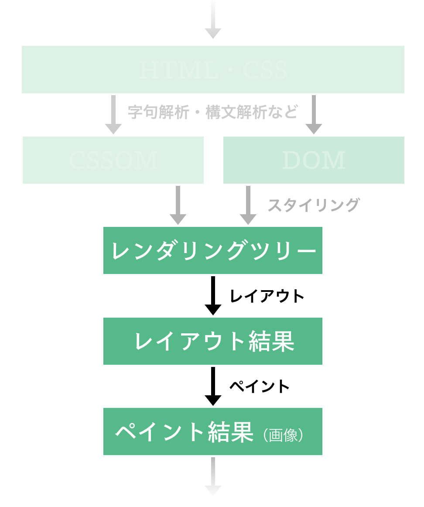
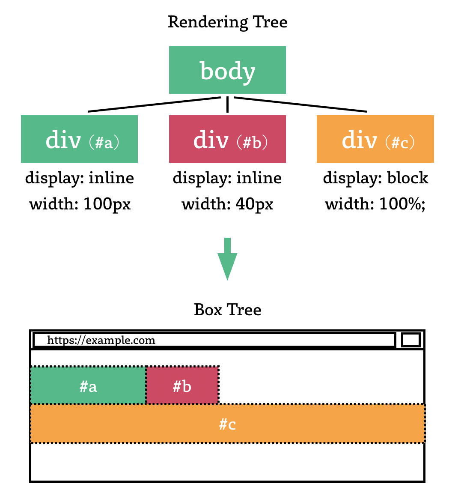
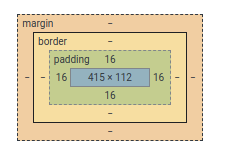
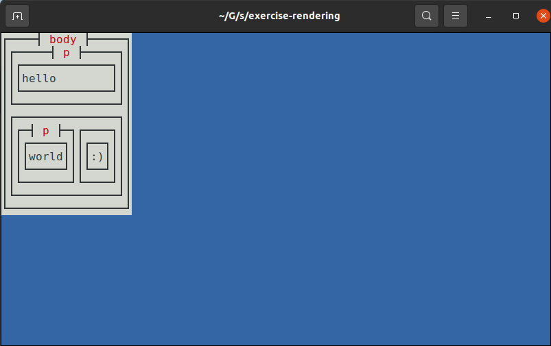

前の章では DOM と CSSOM を 1 つのデータ構造（レンダリングツリー）にまとめる、というレンダリングの下準備をしました。
ここからは、このツリーをコンソール画面に描画する処理の実装例を、レイアウト処理・ペイント処理の 2 ステップに分けて紹介します。



> **:memo: 注意** 本オンラインブックはセキュリティ・キャンプでの講義の事前資料であり、かつこの周辺は講義で扱う予定がほぼないので、一旦本章はかなり大雑把に書いてあります。
> しばらく後の余裕ができた頃に大幅に書き直す予定です。

## レイアウト

最終的な描画処理の前には、**Web ブラウザ画面内でのレンダリングツリーの各要素の位置や幅・高さ** などが決定されます。この処理はレイアウト（layout）と呼ばれます。



また、レイアウト処理の結果は [box tree](https://www.w3.org/TR/css-display-3/#box-tree) などと呼ばれ、box tree の各要素は [box](https://www.w3.org/TR/css-display-3/#box) と呼ばれます。
およそ box とは、多くの Web ブラウザ実装の開発者ツール内で表示される以下の画像ようなもののことです:



レンダリングツリーを box tree に変換するときには、レンダリングツリーの各要素の `display` プロパティの値が重要なファクターになります。
この点に関しては [MDN の説明](https://developer.mozilla.org/ja/docs/Learn/CSS/Building_blocks/The_box_model) を読んでから、[CSS Display Module Level 3](https://www.w3.org/TR/css-display-3/) での説明を読むと一通り理解できるかと思いますから、ぜひ自力でこれらを参照してください。

以下に ["レンダリングツリーを作る"](/chapters/building-rendering-tree) で生成した `StyledNode` を box を表すデータ構造 `LayoutBox` に変換する処理の実装例を示します:

```rust
use crate::style::{Display, PropertyMap};
use crate::{dom::NodeType, style::StyledNode};

#[derive(Debug, PartialEq)]
pub struct LayoutBox<'a> {
    pub box_type: BoxType<'a>,
    pub children: Vec<LayoutBox<'a>>,
}

#[derive(Debug, PartialEq)]
pub enum BoxType<'a> {
    BlockBox(BoxProps<'a>),
    InlineBox(BoxProps<'a>),
    AnonymousBox,
}

#[derive(Debug, PartialEq)]
pub struct BoxProps<'a> {
    pub node_type: &'a NodeType,
    pub properties: PropertyMap,
}

pub fn to_layout_box<'a>(snode: StyledNode<'a>) -> LayoutBox<'a> {
    LayoutBox {
        box_type: match snode.display() {
            Display::Block => BoxType::BlockBox(BoxProps {
                node_type: snode.node_type,
                properties: snode.properties,
            }),
            Display::Inline => BoxType::InlineBox(BoxProps {
                node_type: snode.node_type,
                properties: snode.properties,
            }),
            Display::None => unreachable!(),
        },
        children: snode
            .children
            .into_iter()
            .fold(vec![], |mut acc: Vec<LayoutBox>, child| {
                match child.display() {
                    Display::Block => {
                        acc.push(to_layout_box(child));
                        acc
                    }
                    Display::Inline => {
                        match acc.last() {
                            Some(&LayoutBox {
                                box_type: BoxType::AnonymousBox,
                                ..
                            }) => {}
                            _ => acc.push(LayoutBox {
                                box_type: BoxType::AnonymousBox,
                                children: vec![],
                            }),
                        };
                        acc.last_mut().unwrap().children.push(to_layout_box(child));
                        acc
                    }
                    Display::None => unreachable!(),
                }
            }),
    }
}
```

[^anon]: レンダリングツリーの要素と対応関係を持たない [anonymous box](https://www.w3.org/TR/css-display-3/#anonymous) という box も存在します。

## ペイント

レイアウト処理の後に Web ブラウザに残された仕事は、そのレイアウトを画面に描画するための処理を実行することです。
この処理は**ペイント（Paint）**と呼ばれるものです。

以下にレイアウト結果（`LayoutBox`）を [cursive](https://docs.rs/cursive/0.16.3/cursive/view/trait.ViewWrapper.html) を用いてターミナル内に描画する処理の実装例を示します:

```rust
use crate::{
    dom::NodeType,
    layout::{BoxProps, BoxType, LayoutBox},
};
use cursive::{
    view::{IntoBoxedView, View, ViewWrapper},
    views::{DummyView, LinearLayout, Panel, TextView},
};

pub type ElementContainer = Box<dyn View>;

pub fn new_element_container() -> ElementContainer {
    (DummyView {}).into_boxed_view()
}

pub fn to_element_container<'a>(layout: LayoutBox<'a>) -> ElementContainer {
    match layout.box_type {
        BoxType::BlockBox(p) | BoxType::InlineBox(p) => match p {
            BoxProps {
                node_type: NodeType::Element(ref element),
                ..
            } => {
                let mut p = Panel::new(LinearLayout::vertical()).title(element.tag_name.clone());
                match element.tag_name.as_str() {
                    _ => {
                        for child in layout.children.into_iter() {
                            p.with_view_mut(|v| v.add_child(to_element_container(child)));
                        }
                    }
                };

                p.into_boxed_view()
            }
            BoxProps {
                node_type: NodeType::Text(ref t),
                ..
            } => {
                // NOTE: This is puppy original behaviour, not a standard one.
                // For your information, CSS Text Module Level 3 specifies how to process whitespaces.
                // See https://www.w3.org/TR/css-text-3/#white-space-processing for further information.
                let text_to_display = t.data.clone();
                let text_to_display = text_to_display.replace("\n", "");
                let text_to_display = text_to_display.trim();
                if text_to_display != "" {
                    TextView::new(text_to_display).into_boxed_view()
                } else {
                    (DummyView {}).into_boxed_view()
                }
            }
        },
        BoxType::AnonymousBox => {
            let mut p = Panel::new(LinearLayout::horizontal());

            for child in layout.children.into_iter() {
                p.with_view_mut(|v| v.add_child(to_element_container(child)));
            }

            p.into_boxed_view()
        }
    }
}
```

## HTML の描画を試す

["前提を整理する"](/chapters/basic-concepts) では以下の HTML を描画することをゴールとしたのでした:

```html
<body>
  <p>hello</p>
  <p class="inline">world</p>
  <p class="inline">:)</p>
  <div class="none"><p>this should not be shown</p></div>
  <style>
    .none {
      display: none;
    }
    .inline {
      display: inline;
    }
  </style>
</body>
```

いま、実際に ["レンダリングツリーを作る"](/chapters/building-rendering-tree) までで行った実装と本章で示した実装例などを付け加えることで、コンソール画面に上述の HTML を描画できるようにした実装の例を https://github.com/tiny-browserbook/exercise-rendering に用意しました。これは以下のコマンドによりダウンロードできます:

```sh
git clone https://github.com/tiny-browserbook/exercise-rendering
```

### 実装例の概要

この実装では、`src/main.rs` において、描画したい HTML を定数として定義しています:

```rust
const HTML: &str = r#"<body>
    <p>hello</p>
    <p class="inline">world</p>
    <p class="inline">:)</p>
    <div class="none"><p>this should not be shown</p></div>
    <style>
        .none {
            display: none;
        }
        .inline {
            display: inline;
        }
    </style>
</body>"#;
```

次に描画の際に利用する、デフォルトの CSS（= User Agent Style Sheet）を同じく定数として定義します:

```rust
const DEFAULT_STYLESHEET: &str = r#"
script, style {
    display: none;
}
p, div {
    display: block;
}
"#;
```

そして、これらを実際にコンソール上に描画するために、以下のような `main()` 関数（とその補助関数）を定義しています:

```rust
fn main() {
    let mut siv = cursive::default();

    let node = html::parse(HTML);
    let stylesheet = css::parse(&format!(
        "{}\n{}",
        DEFAULT_STYLESHEET,
        collect_tag_inners(&node, "style".into()).join("\n")
    ));

    let container = to_styled_node(&node, &stylesheet)
        .and_then(|styled_node| Some(to_layout_box(styled_node)))
        .and_then(|layout_box| Some(to_element_container(layout_box)));
    if let Some(c) = container {
        siv.add_fullscreen_layer(c);
    }

    siv.run();
}

pub fn collect_tag_inners(node: &Box<Node>, tag_name: &str) -> Vec<String> {
    if let NodeType::Element(ref element) = node.node_type {
        if element.tag_name.as_str() == tag_name {
            return vec![node.inner_text()];
        }
    }

    node.children
        .iter()
        .map(|child| collect_tag_inners(child, tag_name))
        .collect::<Vec<Vec<String>>>()
        .into_iter()
        .flatten()
        .collect()
}
```

### 実装例の実行

[演習用の環境を構築する](/chapters/setup) で Rust や puppy が実行できる環境が整っていれば、ダウンロードしてきた `exercise-rendering` ディレクトリ内で以下のようなコマンドを実行することで、実際に HTML を画面に描画することができます:

```sh
cargo run
```

正しく実行されていれば以下のような画面が表示されるはずです:



やりました！ Part 1 は無事終了です。

> **:muscle: 演習: 描画する HTML ファイルを実行時にロードする**
>
> 演習用実装は現在、Rust ソースコード中に直接 HTML を埋め込み、それを描画するような形をとっています。
> これをやめ、`cargo run -- test.html` のような形で HTML ファイルのパスを受け取り、そのファイルの中身を描画するように演習用実装を書き換えてみましょう。
>
> 意欲のある方は、`http://` や `https://` から始まるような URL を受け取って、その URL の中身を HTTP/HTTPS 経由で取得して描画できるようにもしてみてください。

> **:muscle: 演習: margin と padding を実装する**
>
> [CSS Box Model Module Level 3](https://www.w3.org/TR/css-box-3/) を参考にしつつ、CSS の `margin` / `padding` プロパティを自作ブラウザ上で利用できるようにしてみましょう。
