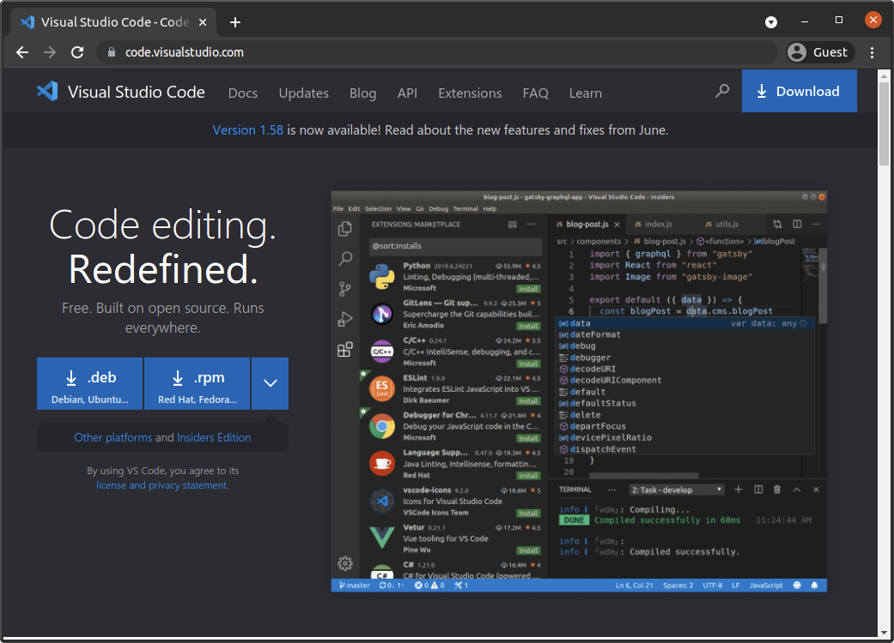
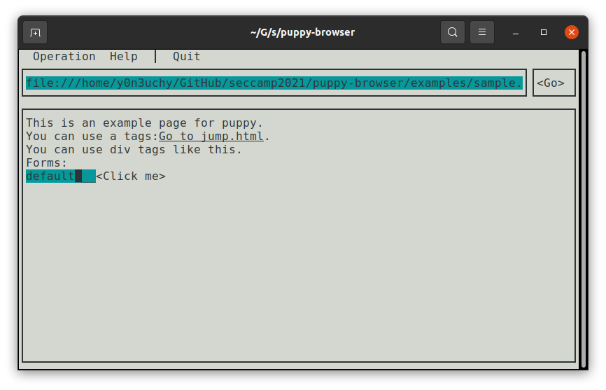

ちいさな Web ブラウザを自作していくことになる以降の章では、あなたのお手元のコンピュータでそのソースコードをビルドし、生成されたファイルを実行してテストをしてもらうことになります。その過程ではいくつかの OSS を利用します。

この章では、本書が以降で断りなく利用するようなソフトウェアの準備方法を説明します。

## macOS / Linux 環境

以降の章ではあなたが macOS または何らかの Linux ディストリビューション上で作業を行っていることを仮定します[^challenge]。

Windows ユーザの方は [Windows Subsystem for Linux Installation Guide for Windows 10](https://docs.microsoft.com/en-us/windows/wsl/install-win10) などを通して、適宜 Linux 環境を構築してください。

[^challenge]:
    もっとも、これ以外の環境でも、本 Web サイトで紹介するような Web ブラウザを作り切ることはできるはずです。
    どうしても本章で挙げていない OS を利用したい方や、挑戦心にあふれる方は、お好きな環境を使っていただいて構いません。

## Rust ツールチェイン

以降の章では原則 Rust というプログラミング言語を利用します。
近年安全性が求められるソフトウェアの開発での採用が進む Rust 言語は、Web ブラウザ開発の世界においても、Firefox が採用しているレンダリングエンジン [Servo](https://github.com/servo/servo)[^rendering_engine] において用いられています。

[Rust 公式 Web ページの案内（https://www.rust-lang.org/tools/install）](https://www.rust-lang.org/tools/install) の通りに Rust ツールチェインをインストールしましょう。

インストールが出来たようであれば、シェルを起動して、次のコマンドを実行してみてください:

```sh
cargo version
```

正しく Rust ツールチェインがインストールされていれば、次のような形で、インストールされた `cargo` というツールのバージョン情報が得られるはずです:

```
cargo 1.51.0 (43b129a20 2021-03-16)
```

[^rendering_engine]: レンダリングエンジンという言葉については以降の章で説明します。

## ソースコードエディタ

以降の章では多くの時間をソースコードを読み書きするのに費やすことになります。
予め使いやすいソースコードエディタを整備しておくのが賢明です。
適当なものをダウンロードし、満足のいくまで設定を施しておいてください。

もっとも、本 Web サイトのこの後のハンズオンは特にソースコードエディタに依存していませんから、どんなものを利用してもかまいません。
なお、筆者は Visual Studio Code を、[このリンク先のファイル（extensions.json）](https://github.com/lmt-swallow/puppy-browser/blob/b2d37ec2791bb3bfc44224a9d6c44b9a6ab73b0c/.vscode/extensions.json) に示されているような拡張機能と、[このリンク先のファイル（launch.json）](https://github.com/lmt-swallow/puppy-browser/blob/b2d37ec2791bb3bfc44224a9d6c44b9a6ab73b0c/.vscode/launch.json)に示されているデバッガ設定とともに利用しています。



## puppy

_puppy_ は本章以降で作成する Web ブラウザのリファレンス実装です。
そのソースコードは [https://github.com/lmt-swallow/puppy-browser](https://github.com/lmt-swallow/puppy-browser) にて公開されています。

ここまで本章で紹介してきたツールが正しくセットアップできていれば、puppy は既にあなたのお手元のコンピュータで実行できるはずです。
試しにシェル上で次のコマンド群を実行してみましょう:

```sh
git clone https://github.com/lmt-swallow/puppy-browser puppy-browser
cd puppy-browser
cargo run -- open examples/sample.html
```

もし正しく puppy が実行できていれば、およそ以下のような画面が表示されるはずです:


