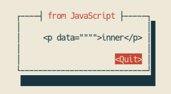

以下は本オンラインブックのリファレンス実装 [puppy](https://github.com/lmt-swallow/puppy-browser) に関連する演習です。

## 演習 02-01

puppy 上でナビゲーションが起こった際、puppy は全ての場面で、ナビゲーション先の URL から取得したリソースを UTF-8 でエンコードされた HTML だと思って解釈します。
もしメジャーな既存 Web ブラウザが同じような挙動を取るとすると、どのような問題が起こるかを考え、簡単に説明してください。

## 演習 02-02

### puppy の挙動

以下のような HTML を puppy で開いたとします。

```
<div id="in"><p data="&quot;&quot;">inner</p></div>
<script>
    let el_in = document.getElementById("in");
    window.alert(el_in.innerHTML);
</script>
```

すると、以下のようなポップアップが表示されます:



### 問い

あなたは以下の HTML の 1 行目の `<p>` タグの `data` 属性の値を任意に設定できるとします。

```
<div id="in"><p data="...">inner</p></div>
<div id="out"></div>
<script>
    let el_in = document.getElementById("in");
    let el_out = document.getElementById("out");
    el_out.innerHTML = el_in.innerHTML;
</script>
```

この条件のもとで以下の 2 つを考えてみましょう:

1. puppy で上記の Web ページを開いた際、`<div id="in">...</div>` タグの中身と `<div id="out">...</div>` タグの中身が異なってしまうような `data` 属性の値は存在するでしょうか。
2. もしメジャーな既存 Web ブラウザにおいて、そのような `data` 属性の値が存在するとしたら、どのような問題が起こるでしょうか。

## 演習 02-03

> 余力があればこの演習にも取り組んでください。

puppy の全ての機能が 1 つのプロセス内で動作します。
このまま puppy の実装を拡大させていくと、セキュリティ上どのようなリスクがあるかを検討し、簡単に説明してください。
