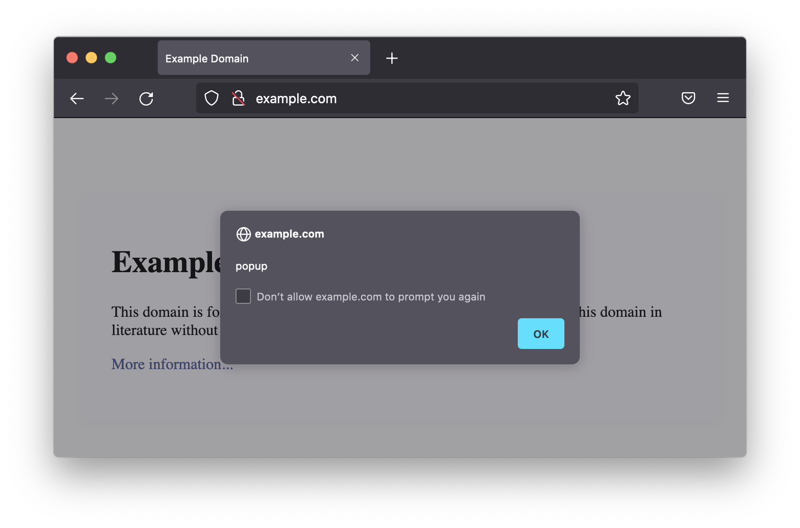
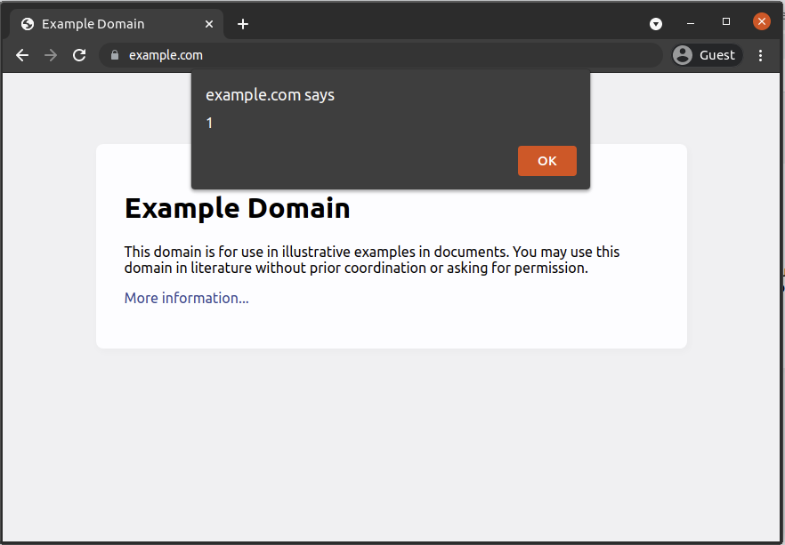

## 演習 03-01

Mixed Content に関する挙動を以下のデモページで確認してみましょう。

- https://www.mixedcontentexamples.com/

## 演習 03-02

Chromium 系ブラウザで以下のデモページを開き、Permissions Policy の挙動を確認してみましょう。

- https://feature-policy-demos.appspot.com/

## 演習 03-03

現時点の Firefox は `alert()` などのダイアログを画面中央に表示します。

一方、現時点の Chromium は `alert()` などのダイアログを、アドレスバー周辺の Web ページ外の領域にややかぶるような位置に表示します。

これらはセキュリティ上なんらかの違いを生みうるでしょうか。考えてみましょう。
